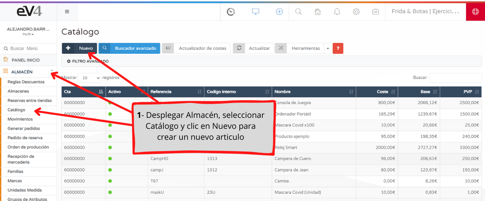
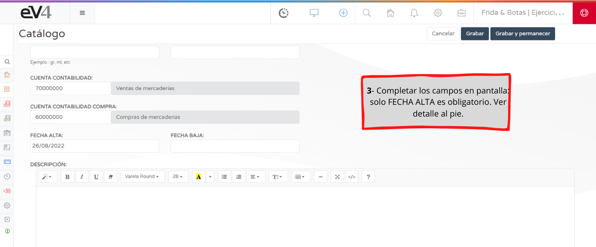

In this tutorial, we show you how to manually register an item. For information on bulk item registration, see "Import from Excel Files."

**REFERENCE**: This is mandatory and unique for each item and should never be modified. Create it in a way that easily identifies the item. For example, AL001.

**INTERNAL CODE**: This is also used to identify the product, but it is not mandatory. It can be used, for example, as the supplier reference.

**EAN-13**: Here, you enter the barcode for the item. This can be done manually or with a scanner, by positioning the cursor in the field.

**NAME**: Enter the name of the item. This is mandatory and can be modified at any time.

**SHORT NAME**: This is the abbreviated name of the product that will be shown on the receipt.

**LOCATION**: Enter the location of the item in the warehouse, if applicable. For example: Aisle 2, Shelf 4.

**BRAND**: Select the brand of the item. It must be pre-registered in the system (can be done via “ADD +”).

**UNIT OF MEASURE**: Select the unit of measurement for the item. It must be pre-registered in the system (can be done via “ADD +”).

**UM VALUE**: Enter the corresponding value. This applies to the printing of labels for chemical products or their derivatives.

**UM TYPE**: Enter the corresponding type. This applies to the printing of labels for chemical products or their derivatives.

**FEATURED IMAGE**: Upload the image of the item.

**FAMILY / CATEGORIES**: Select the family or families, if applicable. These must be pre-registered in the system under the FAMILIES section.

**ACCOUNTING / PURCHASE ACCOUNT**: Select the accounting accounts, if a chart of accounts has been previously entered, or simply leave the default accounts defined by eV4.

**REGISTRATION DATE**: Enter the date of registration for the item in eV4.

**DISCONTINUATION DATE**: Enter the date to discontinue the item.

**DESCRIPTION**: Write, if necessary, a description of the item. This will be transferred to the online store if applicable.

**VAT**: Select the VAT applicable to the item.

**PRICE EXCLUDING VAT**: Enter the price of the item excluding VAT (it is automatically calculated when the retail price is entered, depending on the configuration).

**RETAIL PRICE (PVP)**: Enter the retail price of the item, including VAT (it is automatically calculated when the price excluding VAT is entered, depending on the configuration).

**% MARGIN**: Enter the profit margin percentage from the sale of the item.

**WHOLESALE**: This is the same as the PRICE EXCLUDING VAT, PVP, and % MARGIN but for wholesale prices. eV4 allows maintaining both prices for each item.

**COST**: Enter the cost of the item.

**MINIMUM STOCK**: Enter the minimum stock quantity for the item.

**MINIMUM ORDER**: Enter the minimum quantity you want for each order.

**PUBLISH ONLINE**: Select YES/NO to enable the item for the online store.

**MANAGE STOCK**: Select YES/NO to configure whether the item adjusts its movements according to the stock entered in the system.

**STATUS**: Expand the menu to select the item’s status.
