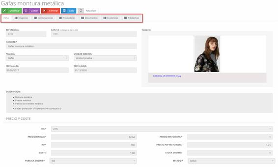

# Stock

When accessing the **Catalog**, the main screen will display a list of products entered into the system. Initially, this list will be empty.

📌 *See Image 181: Warehouse – Catalog*

---

## 8.2.1 Stock - New (product)

To add a new product to the catalog:

1. Click the **New** button on the initial catalog screen.
2. A form will open to complete the product information.

📌 *See Image 182: Warehouse - Catalog – New*

### Data to complete:
- **Reference:** Product identifier code.
- **EAN-13:** Barcode.
- **Name:** Product or item name.
- **Short Name:** Abbreviated product name.
- **Image:** Product image.
- **Brand:** Product brand.
- **Family:** Product category or family.
- **Unit of Measure:** The way the product is measured (unit, cm, etc.).
- **Entry Date:** Date when the product will be available.
- **Exit Date:** Date when the product will no longer be available.
- **Description:** Detailed product information.
- **VAT:** Tax applied to the product.
- **Price (excluding VAT):** Price without taxes.
- **Retail Price (PVP):** Retail price.
- **Cost:** Product cost.
- **Publish Online:** Indicates if the item will be visible on the online store (Prestashop).
- **Wholesale Price:** Price for wholesalers.
- **Wholesale Retail Price (PVP):** Retail price for wholesalers.
- **Minimum Stock:** Minimum quantity before the product is considered out of stock.
- **Status:** Current status of the product.

Once the form is complete, click **Save** to store the product in the system.

📌 *See Image 183: Warehouse - Catalog – Modify*

---

## 8.2.2 Stock – Modify (Tabs)

To modify an existing product:

1. Click on the product to modify in the **Catalog**.
2. A new screen will open with tabs associated with the product.
3. Click the **Modify** button, make the changes, and then click **Save**.

📌 *See Image 184: Warehouse - Movements – List of Movements*

### Available Tabs:
- **Sheet:** Main product information.
- **Images:** Add images to the product.
- **Combinations:** Configuration of products by attributes.
- **Suppliers:** Manage suppliers associated with the product.
- **Documents:** Documents attached to the product.
- **Stock:** Current stock, minimum stock, and quantity under order.
- **Prestashop:** Synchronize the product with Prestashop.

📌 *See Image 185: Warehouse - Movement – New*

---

# 8.3 Movements

This section contains warehouse movements, such as product entries and exits.

📌 *See Image 81: Warehouse - Movements - List of Movements*

Movements can be filtered by dates or products.

## 8.3.1 Movements – New

To create a new movement:

1. Click the **New** button on the movements screen.
2. A form will open to complete the movement data.

📌 *See Image 82: Warehouse - Movement - New*

### Data to complete:
- **Movement Number:** Identifier of the movement (unlocked by clicking the padlock).
- **Movement Type:** Classification of the movement.
- **Date:** Date of the movement.
- **Note:** Additional information about the movement.
- **Description:** Product and details.
- **Quantity:** Quantity of products.
- **VAT:** Applied tax.
- **Base Price:** Base price of the product.
- **Total:** Total price based on quantity.
- **Add Button:** Add a new product line.
- **Exempt Base:** Base price exempt from VAT.
- **Taxable Base:** Taxable amount.
- **VAT Amount:** Calculated tax.
- **Total Invoice:** Total invoice amount.

Once the data is completed, click **Save** to store the movement in the system.
