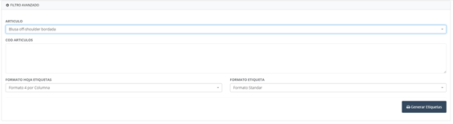
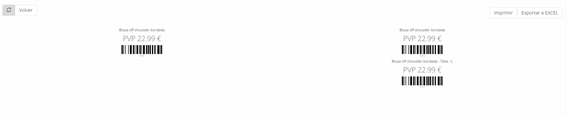

# Labels

In this section, we can **print labels** for the various products in the catalog within the system.

To do this, simply:

1. Select the **item** or enter the **item code**.
2. Choose the **sheet format**.
3. Select the **label format**.

## Label Generation

We can enter a **reference code** per line and use the **(*)** operator to obtain the desired number of labels for each reference:

MDU46531*5 → (we will get 5 labels)  
MDU46532    → (we will get 1 label)

The result would be as shown in the following image. Additionally, we have the option to print them.

