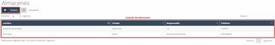

# WAREHOUSE  

In this section of the system, we find the **features associated with warehouses**, such as **catalog, movements, and families**, among others.  

---

## **8.1 Warehouses**  

Here, you can view the **different warehouses** available in the system.  

---

## **8.1.1 Warehouses – New**  

To **create a new warehouse or center**, click the **"New"** button on the initial warehouse screen.  

This will open a form to complete with the warehouse information.  

### **Fields to complete:**  
- **Name:** Name of the warehouse or center.  
- **Phone:** Phone number of the warehouse or center.  
- **Address:** Address of the warehouse or center.  
- **Postal Code:** Postal code of the locality.  
- **City:** City where it is located.  
- **Country:** Country where it is located.  
- **Province:** Province where it is located.  
- **Locality:** Locality where the warehouse is located.  
- **Inventory Management:** Method used for managing inventory.  
- **Warehouse Manager:** Person in charge of the warehouse.  
- **Note:** Additional information about the warehouse or center.  
- **Geolocation:** Geographic coordinates of the warehouse.  

Once these fields are completed, click the **"Save"** button to store the information in the system.
