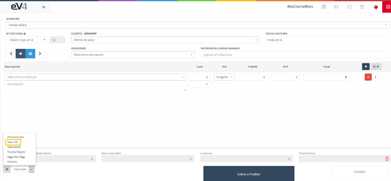
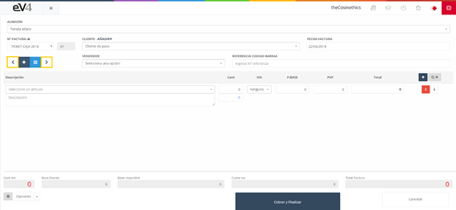
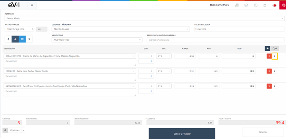
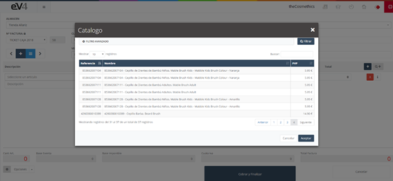
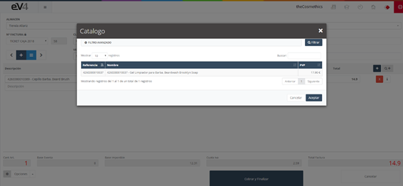
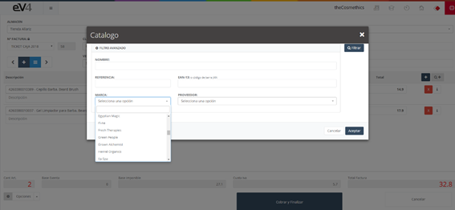
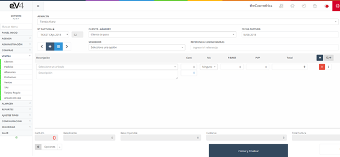

# **POS Management in eV4 ERP**  

The **POS (Point of Sale)** is the tool for managing **in-store sales** of the company, facilitating quick and easy interaction with customers.  

When accessing the POS, a list of all **invoices generated** is displayed, whether manually created from the sales section or directly from the POS. A filter is available to facilitate **searching**.

---

## **Initial POS View**  

The initial view of the **POS** section shows the **search fields** empty by default. When performing a search, the fields retain the entered values, making it easier to repeat searches. To **reset** the template and clear the data from the last search, simply click the **“Reset”** button.

---

## **New POS**  

The **New POS** panel has a **user-friendly** layout, similar to the sales section but more focused on ease of use. 

- To access the **full view**, go to the **“Options”** dropdown button at the bottom right and select **"More Info"**.

---

### **Main Buttons in the New POS**  

1. **NEW POS Button (+):**  
   - **Location:** Top left, under the **“Invoice Number”** field.  
   - **Function:** Creates a **new ticket**, clearing all fields and returning them to their initial state.

2. **List Button:**  
   - **Location:** Next to the **NEW POS** button.  
   - **Function:** Takes you back to the initial **POS** section.

3. **Forward/Backward Buttons:**  
   - **Location:** To the left and right of the previous buttons.  
   - **Function:** Allows loading the **previous** or **next** ticket.

4. **Add Item Button:**  
   - **Location:** Top right, with the **+** symbol.  
   - **Function:** **Adds a product line** to the ticket.

5. **Delete Button (x):**  
   - **Location:** Red button with an **X**.  
   - **Function:** Deletes a product line from the ticket or invoice.

6. **Info Button (i):**  
   - **Location:** White button with the letter **i**.  
   - **Function:** Displays additional information about the product on that line.

7. **Consult Catalog Button (Q+):**  
   - **Location:** To the right of the **Add Item** button.  
   - **Function:** Allows searching for an item in the catalog by various criteria like **name, reference, EAN-13, brand, supplier**.

---

## **Advanced Searches**  

You can perform precise searches using the following criteria:

1. **Name:**  
   - Type the item name and click **"Filter"**.

   

   

   - Double-click to add it to the ticket.

2. **Reference:**  
   - Type the item reference and click **"Filter"**.

   

   

   - Double-click to add it to the ticket.

3. **EAN-13 (Barcode):**  
   - Similar to the reference, search using the barcode.

4. **Brand:**  
   - Filter by brand by selecting one from the dropdown and clicking **"Filter"**.

5. **Supplier:**  
   - Filter by supplier by typing the name or selecting it from the list.

---

## **Main Fields in POS**  

- **Invoice Number:** Select the **series** to which the invoice will belong.  
- **Customer – Add+:** Select the **customer** for whom the invoice will be issued.  
- **Invoice Date:** Set the **invoice** date.  
- **Due Type:** Select the type of due date (**cash, 30, 60, 90 days**).  
- **Due Date:** Set the **invoice due date**.  
- **Seller:** Select the **seller** assigned to the sale.  
- **Barcode Reference:** Allows **scanning** the barcode or manually entering it.  
- **Item:** A line for each item included in the invoice.

---

## **Available Options in POS**  

1. **Promotions:**  
   - Allows selecting a **current promotion** to apply to the ticket.

2. **More Info:**  
   - Switches between the **simplified** and **full** views of the POS.

3. **Discount:**  
   - Applies a **discount** to the invoice.

4. **Gift Card:**  
   - **Loads** a gift card to the invoice.

5. **Second Payment:**  
   - Allows setting a **second payment** for the invoice.

6. **Change:**  
   - Indicates the **change** to be given to the customer.

---
