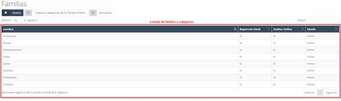
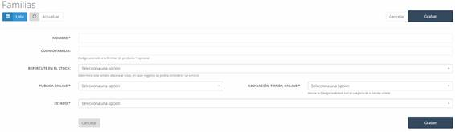
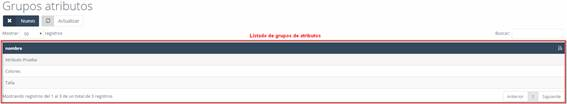
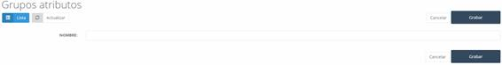
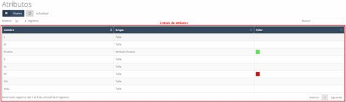
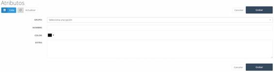
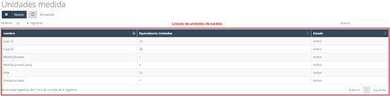

# Families

In **Families**, we find the categories in which products in the catalog can be grouped.

📌 *See Image 221: Warehouse – Families – List*

---

## 8.10.1 Families – New

To create a new family:

1. Click the **New** button on the initial **Families** screen.
2. A form will open to complete the information.

📌 *See Image 222: Warehouse - Families – New*

### Data to complete:
- **Name:** Name of the family or category.
- **Family Code:** Identifier for the family.
- **Affects Stock:** Indicates if it affects the stock of the catalog.
  - *If "No", it is considered a service.*
- **Postal Code:** Postal code of the warehouse or center.
- **Publish Online:**
  - *If "Yes", the products will be visible online.*
  - *If "No", products from this family will not be visible.*
- **Online Store Association:** Assigns the family to a **Prestashop** category.
- **Status:** Status of the family or category.

Once the data is completed, click **Save** to store the new family in the system.

---

# 8.11 Attribute Groups

In **Attribute Groups**, we find the groups that allow attributes to be associated with products in the system.

📌 *See Image 223: Warehouse – Attribute Groups – List*

## 8.11.1 Attribute Groups – New

To create a new attribute group:

1. Click the **New** button on the **Attribute Groups** screen.
2. A form will open to complete the information.

📌 *See Image 224: Warehouse – Attribute Groups – New*

### Data to complete:
- **Name:** Name of the attribute group.

Once the field is completed, click **Save** to register the group in the system.

---

# 8.12 Attributes

In **Attributes**, we find the attributes that will be assigned to catalog products, such as **sizes**, **colors**, etc.

📌 *See Image 225: Warehouse – Attributes – List*

## 8.12.1 Attributes – New

To create a new attribute:

1. Click the **New** button on the **Attributes** screen.
2. A form will open to complete the information.

📌 *See Image 226: Warehouse – Attributes – New*

### Data to complete:
- **Group:** Attribute group to which the new attribute belongs.
- **Name:** Name of the attribute.
- **Color:** Color assigned to the attribute.
- **Extra:** Additional information about the attribute.

Once the data is completed, click **Save** to register the attribute in the system.

---

# 8.13 Units of Measure

In **Units of Measure**, we find the units applicable to the products in the catalog.

📌 *See Image 227: Warehouse – Units of Measure – List*
