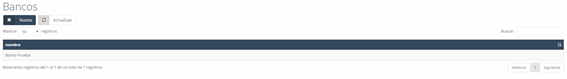

# Banks  

In this section, we find the **list of the various banks** the company works with, either for **account management** or other necessary operations.

---

## **Banks – New**  

We can **add a new bank** to the list by clicking the **"New"** button and filling out the corresponding form, which contains the following fields:

- **Account:** Bank account number.  
- **Entity:** Bank entity code.  
- **Branch:** Branch code.  
- **DC:** Account number.  
- **Name:** Name of the bank.  
- **Address:** Address of the branch.  
- **Phones:** Bank contact phone number.  
- **Contact:** Contact person’s name.  
- **Status code:** Bank’s status in the system.  
- **Note:** Informational note about the bank.  
- **IBAN:** IBAN of the entered bank.  

---

# **Discounts**  

When accessing the **discounts** section, we will see a list of all the existing discounts in the system.  
Each customer can have **associated discounts**, and these may include a **validity date range** for their application to **specific products or catalogs**.

