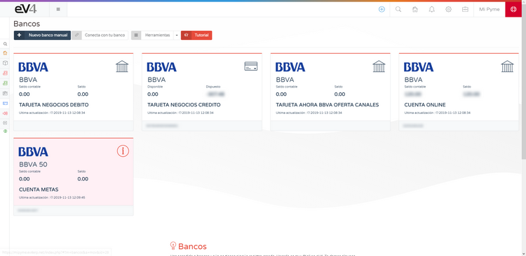
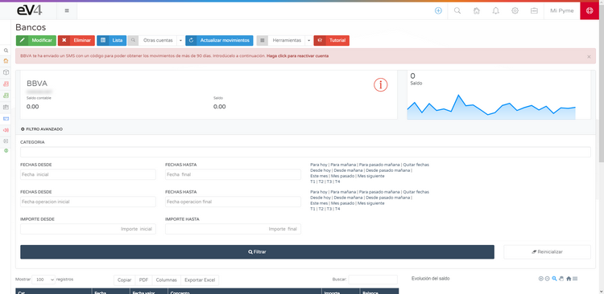
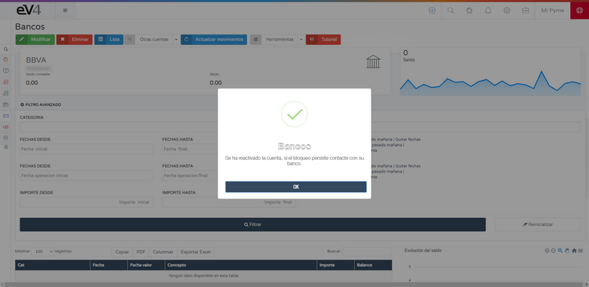
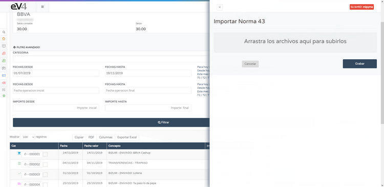
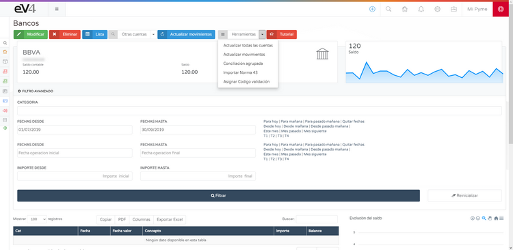
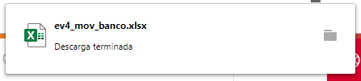
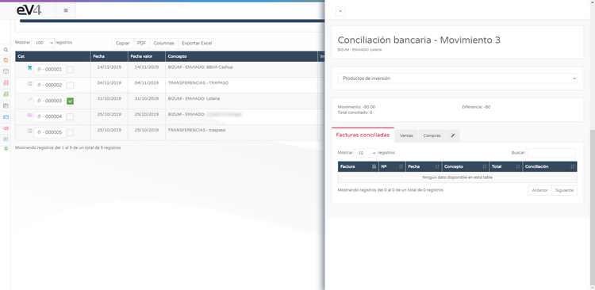
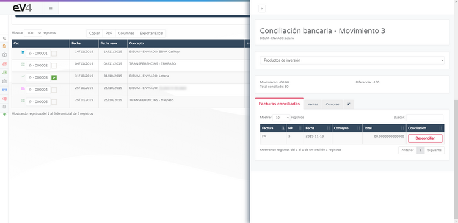
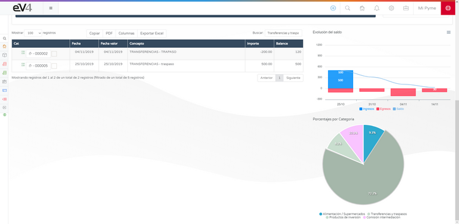

# Connect with Your Bank

eV4 allows you to connect with your bank to view your bank transactions. eV4 only has read-only access to your bank data, meaning it can only view this data. It will never perform any financial transactions (payments, transfers, etc.).

This feature is available in the **Treasury → Banks** menu.

The first time you access, you'll see the following screen:

Click the **Connect with Your Bank** button, and you'll see the next screen where you need to select your bank:

eV4 can work with over 100 banking institutions from Europe and America. You can filter by country by clicking on it, or directly search for it by name. When you find it, click on it.

eV4 adapts to each bank's working method and will ask for the necessary data required by the bank:

Once the required data is entered, click the **Connect** button.

The first time eV4 connects with your bank, it requests the transactions from the last year. To request transactions for periods longer than 90 days, according to European regulations, your bank must provide you with a control code, which you need to enter next:

Click the **Validate** button and wait for the process to finish. Afterward, your bank accounts will be displayed on the screen:

If any account has a red **i** symbol inside a circle, it means the user must take action. Click on an account to open it.

Follow the instructions, in this case, click the **Click to Reactivate Account** button:

Then wait for the process to finish.

At the top of the screen, you have the **Tools** dropdown menu with the following options:

- **Update All Accounts:** Updates the transactions for all accounts.
- **Update Transactions:** Updates the transactions for this account.
- **Grouped Reconciliation:** Opens the window to reconcile the transactions with the invoices.
- **Import Norm 43:** Import the Norm 43 file provided by your bank.

- **Assign Validation Code:** When reactivating an account, this opens a window to enter the verification code.

At the top of the screen, you have the **Other Accounts** dropdown menu, allowing you to switch to another account directly without going through the bank screen.

Once the transactions are downloaded, you can filter the period you want to view by specifying the date range in the **Advanced Filter**.

Above the transaction list, you have 4 buttons:

- **Copy:** Copies all transactions to the clipboard.
- **PDF:** Generates a PDF document of the transactions.

- **Columns:** Opens a menu where you can select the columns you want to display in the transaction list.

- **Export to Excel:** Generates an Excel spreadsheet with the transaction list.

# Bank Reconciliation

Bank reconciliation, broadly speaking, refers to a part of the company's treasury management. In other words, the company must justify each bank transaction with its operation, which is known as bank reconciliation.

Bank reconciliation is the act of justifying each bank transaction with our operations. It involves matching the various movements in the bank with our invoices. Determining that each transaction corresponds to an invoice.

To reconcile a transaction with an invoice, you first need to select a transaction by marking the checkbox next to its number and then select **Grouped Reconciliation** in the **Tools** menu.

If no transaction is selected first, you will see the following error message:

You will then see the following screen:

You can classify the transactions into different categories, each with its own icon.

At the bottom right, there are 4 tabs:

- **Reconciled Invoices:** Here you will see the invoice reconciled with this transaction.
- **Sales:** Here you will see the available sales invoices in the system.
- **Purchases:** Here you will see the available purchase invoices in the system.
- **Assistant:** Here you will see the invoices that the system suggests may be related to the transaction.

To reconcile the transaction with an invoice, select it from the available invoices, whether they are sales, purchase, or system-suggested, and then click the **Reconcile** button.

Now the selected invoice will appear in the **Reconciled Invoices** tab. If you want to un-reconcile the invoice, simply click the **Un-reconcile** button.

Once we have classified the transactions, the graphs on the right side of the screen are interactive:

In the bar chart, you can enable/disable the corresponding data by clicking on the names: **Income**, **Expenses**, and **Balance**.

The pie chart assigns a color to each category that we've assigned to the transactions, and clicking on a section of the chart will filter the transactions for that category.

To return to the full list of transactions, click on the lower legend where the assigned categories are listed.
