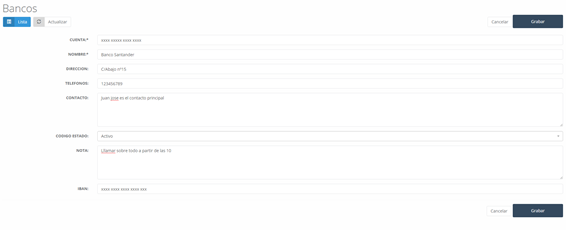

# Banks

In this section, we find the list (see Image 25: Bank List) of the different banks the company works with, whether for managing the company's accounts or other operations required by the company.

Image 38: Bank List

# 5.4.1        Banks – New

We can add a new bank to the bank list by clicking the new button and filling out the form (see Image 26: New Bank) that will appear with the following fields:

- **Account**: Bank account number.
  
- **Entity**: Bank entity code.

- **Branch**: Branch code.

- **DC**: Account number.

- **Name**: Bank name.

- **Address**: Branch address.

- **Phone**: Bank contact phone number.

- **Contact**: Name of the contact person.

- **Status Code**: Bank status in the system.

- **Note**: Informational note about the bank.

- **IBAN**: IBAN of the entered bank.

Image 39: New Bank

# 5.5        Discounts

When accessing discounts, the main screen shows a list of discounts (see Image 27: Discounts) available in the system, which can later be associated with each customer. Additionally, they can be associated with a date range during which they will be valid for applying to a specific product or catalog.

Image 40: Discounts
