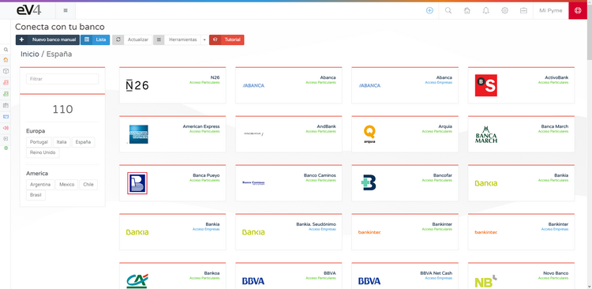

# Connect with Your Bank

eV4 allows you to connect with your bank to view your bank transactions. eV4 only has read-only access to your bank data, meaning it can only consult this data. It will never be able to perform financial operations (payments, transfers, etc.).

This feature can be found in the **Treasury → Banks** menu.

The first time you access, you will see the following screen:

Click on the **Connect with Your Bank** button, and you will see the following screen where you will need to select your bank entity:

eV4 can work with over 100 banking entities in Europe and America. You can filter banking entities by country by clicking on it or search directly by name. Once you find it, click on it.

eV4 adapts to each bank’s method and will ask you for the necessary data required by that bank:

Once you’ve entered the required data, click the **Connect** button.

The first time eV4 connects to your bank, it requests transactions from the past year. To request transactions for periods longer than 90 days, according to European regulations, your bank must provide you with a control code that you need to enter next:

Click the **Validate** button and wait for the process to finish. Then, the accounts you have with this banking entity will appear on the screen:

If any of the accounts show a red **i** symbol inside a circle, it means the user needs to take action. If you click on an account, you will enter it.

Follow the instructions, in this case, click on the **Click to Reactivate Account** button:

Then, wait for the process to complete.

Continue
