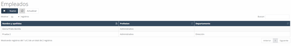

# Employees

When accessing the employees section, the first thing we see on the screen is a list of employees (see Image 16: Employees) entered into the system (initially, it is empty).

  
Image 16: Employees

## 5.2.1 Employees – New

To add a new employee, simply click the "New" button on the initial employee screen (see Image 16: Employees), and a form will appear for you to fill in the employee's details (see Image 18: Employee Schedules). The fields to be filled in are as follows:

- **Full Name**: The employee’s first and last name.

- **Phone**: The employee’s phone number (landline or mobile).

- **Document Type**: The type of personal identification document.

- **Document Number**: The identification number of the selected document type.

- **Social Security Number**: The employee's social security number.

- **Accounting Code**: The code for treasury purposes.

- **Visible in Agenda**: Activates or deactivates the employee in the agenda, i.e., allows the employee to appear or not in the agenda.

- **Salesperson**: Indicates whether the employee is a salesperson in the company.

- **Date of Birth**: The employee's date of birth.

- **Department**: The department the employee currently belongs to.

- **Profession**: The profession currently held by the employee.

- **Status**: The current status of the employee (working, on leave, vacation, etc.)

- **Gender**: The employee’s gender.

- **Bank Account**: The employee's bank account number.

- **Email**: The employee's email address.

- **Address**: The employee’s place of residence.

- **Province**: The province where the employee resides.

- **City**: The city where the employee resides.

- **Center**: The workplace the employee belongs to.

- **Color**: The filter color for the agenda.

- **Employee Photo**: You can upload a new photo of the employee by dragging or clicking on the corresponding box.

  
Image 17: New Employee
