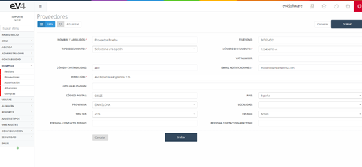

# Suppliers

List of the suppliers from whom products are requested for sale in the company.

  
Image 64: Suppliers

This is the initial view of the ***“SUPPLIERS”*** section, where the search fields are initially blank. When performing a search, the fields will retain the values entered by default, in case it’s necessary to repeat a search related to these data.

If we want to reset the template to its initial state and clear the data from the last search, we can do so by clicking the ***“Reset”*** button.

Within the supplier's content, in addition to the various fields to fill out about the supplier, we have a series of tabs such as the supplier's contacts, PDF files, or related documents we wish to store.

  
Image 65: Supplier View

## 6.2.1 Suppliers – New

To add a new supplier, we need to click the ***“NEW”*** button, which will show us the form as seen in the image above, but this time to fill in the fields:

- **Full Name**: In the case of a company, enter the company name, but for an individual, enter the first and last name.

- **Phone**: General contact phone number.

- **Document Type**: Type of identification document (NIF, NIE, DNI, etc.).

- **Document Number**: Number of the selected document type.

- **VAT NUMBER**: VAT number.

- **Accounting Code**: Code for treasury purposes.

- **Notification Email**: Supplier's email address.

- **Address**: Supplier's address.

- **Geolocation**: Supplier's address in coordinates.

- **Postal Code**: Postal code of the address.

- **Country**: Country where the supplier is located.

- **Province**: Province where the supplier is located.

- **City**: City where the supplier is located.

- **VAT Type**: VAT type that the supplier works with.

- **Status**: Supplier's current status.

- **Order Contact Person**: Contact person from the supplier for orders.

- **Marketing Contact Person**: Contact person from the supplier's marketing department.

  
Image 66: New Supplier
