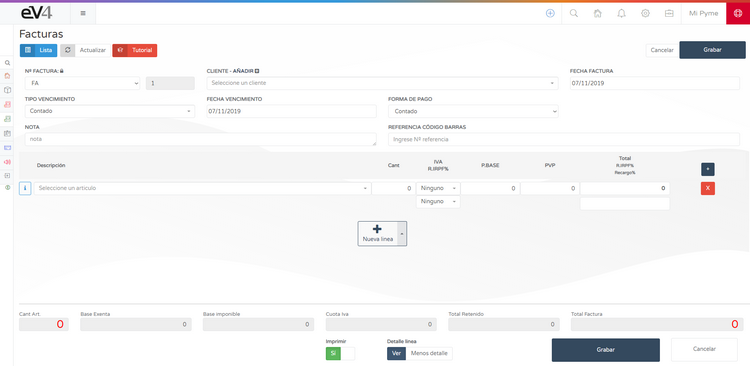

# Creating Invoices  

We have made the first sale, now we will proceed to generate the first invoice.  

---

## Methods to Create an Invoice  

### Quick Method  
1. Click the **ADD** button (blue button on the top right bar).  
2. Click the **NEW INVOICE** button.  

### Method from the menu  
1. Go to **SALES → INVOICES**.  

2. Click the **NEW** button to create a new invoice.  

---

## Creating an Invoice  

When creating an invoice, a screen will load where we can complete the necessary information:  

### Basic Invoice Information  
- **Series**: Select the series to which the invoice belongs.  
- **Customer**: Must be registered in the database.  
- **Date**: By default, the current date is assigned.  
- **Due Date**: You can set the type of due date, date, and payment method.  

### Adding Products to the Invoice  

#### Option 1: Use Barcode  
1. Click on the **BARCODE REFERENCE** field.  
2. When the field turns blue, manually enter the reference or use a barcode scanner.  

#### Option 2: Search Product by Name  
1. Click on the **SELECT AN ITEM** field.  
2. A search bar will appear where you can type the product name.  
3. Matching products will appear, allowing you to select the product.  

### Managing Invoice Lines  
- **Add a line**: Click the **+ NEW LINE** button (located in the center of the screen or the blue button with the **+** symbol on the left).  
- **Delete a line**: Click the **red button with an X** inside.  

### Save the Invoice  
Once all the information is completed, click the **SAVE** button to store the invoice in the system.  

**Note:** Invoices **DO NOT affect stock**.
