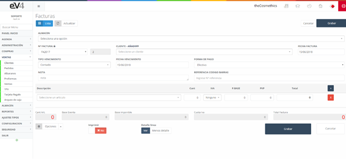

Sales refer to the transactions generated when customers purchase products from our company. Upon accessing this section for the first time, we will see a list of all the generated sales, along with a small filter to help search for them.

[Convert Delivery Note to Invoice - Watch Video](https://www.loom.com/share/e24f4bf2bcd0410fb5f2f6569a1293ea)

Image 110: Sales

This is the initial view of the "INVOICES" section. By default, the search fields are left blank. When a search is performed, the fields will retain the values entered, in case it is necessary to repeat a search with the same data.

If we want to reset the initial state of the template and clear the last search's data, we can do so by clicking the "Reset" button.

## New Invoices

Initial view of the "INVOICES" template.

Image 111: New Invoice 1

To create a new sale, select the **WAREHOUSE**, the invoice series in the "**Invoice No.**" field, the **CUSTOMER** to whom the invoice is issued, and the **invoice issue date** in the "**Invoice Date**" field.

The "**DUE TYPE**" field allows us to select the type of due date: cash, or 30, 60, or 90 days.

Image 112: New Invoice 3

The "**DUE DATE**" field lets us assign the invoice's due date.

In the picture, you can see the "**PAYMENT METHOD**" field, where clicking on it lets us select the payment method for the invoice.

Image 113: New Invoice 4

To quickly add products to the invoice, we can enter the product's barcode using a barcode scanner, which will bring the product and its data. Additionally, by clicking on the "**LINE DETAIL**" button, we can enter more details about the product.

To print and send the invoice, the process is the same as the one followed in previous sections.

Image 114: New Invoice 5

In the "NEW SALE/INVOICE" form, we can find a "**Delivery Notes**" button within the "Options" dropdown menu.

Image 115: New Invoice 6

Clicking it will open a popup window with the delivery notes assigned to the selected customer. There, we can select the delivery notes we want to import and click "Accept." This will automatically import all the lines from the selected delivery notes into our invoice.

Image 116: New Invoice 7

Another functionality in the "Options" dropdown menu is the option to apply a **discount**. When selecting this option, a popup will appear where we can enter a percentage to be discounted from the total price.

Finally, there is the option to access the calendar directly from the new invoice screen, enabling us to schedule an appointment with the customer.

Once the invoice is generated, the view will appear as shown in the following image, with the addition of a new button, "**Collect Invoice**."

Image 117: Invoice View

To collect the payment for the invoice, click on the new button, and a window like the following will appear:

Image 118: Collect Invoice

In **Image 66: Collect Invoice**, we see two tabs: one for **payment**, where we will enter the payment method details for the invoice by the customer, and another for **transactions**, which includes a list of payments for that invoice.
