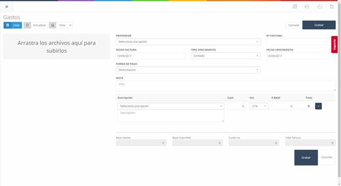

# 5.1 Expenses

This section records the expenses related to the company, such as water, electricity, etc.

In the initial screen (see **Image 14: Administration - Expenses - Expense List**) of this section, we find the list of invoices related to the expenses entered into the system, as well as search filters and a button that allows us to add a new expense (**New Button**).

Image 14: Administration - Expenses - Expense List

### 5.1.1 Expenses – New

To create a new expense, we need to click on the **New** button in the initial expenses screen (see **Image 14: Administration - Expenses - Expense List**). This will take us to a new screen (see **Image 15: Administration - Expenses – New**) where we can add the new expense to the system.

Image 15: Administration - Expenses – New

To add the expense to the system, we need to fill in the fields in the form and click the **Save** button.

- **Supplier**: Supplier of the item or expense.
- **Invoice Number**: Number assigned to the invoice for identification.
- **Invoice Date**: Date the invoice was issued.
- **Payment Type**: Payment method for the invoice.
- **Due Date**: Due date of the invoice.
- **Note**: Additional information if required.
- **Description**: Name of the item or expense.
- **Quantity**: Quantity of items for a product or expense.
- **VAT**: VAT applicable to an expense or product.
- **Base Price**: Base price of an expense or product.
- **Total**: Total price of an expense or product.
