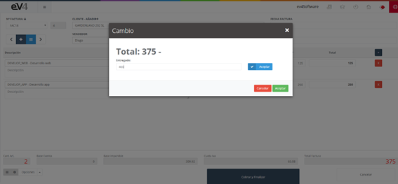

# Change

The “**Change**” option allows us to know the amount of change to return to the customer if they provided an amount greater than the total of the invoice.

Image 154: POS – Change 1

Click the “**Options**” button and select “**Change**.”

Image 155: POS – Change 2

A pop-up window will appear with the invoice amount. You must enter the amount given by the customer and click the “**Accept**” button.

Image 156: POS – Change 3

The breakdown of the amount to be returned to the customer will be displayed.
