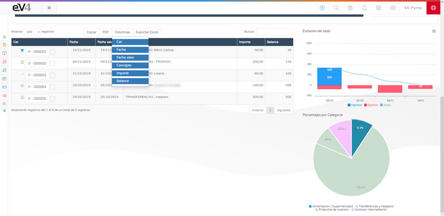

# Connect with Your Bank

eV4 allows you to connect with your bank to check your banking movements. eV4 only has access to your bank data in **read-only mode**, meaning it can only view the data. It will never perform financial operations (payments, transfers, etc.).

This function is located in the **TREASURY → BANKS** menu.

## First Access

The first time we access, we will see the following screen.

Click on the **CONNECT WITH YOUR BANK** button and the next screen will appear, where we must select our bank entity.

eV4 works with over 100 banking entities from Europe and America. We can filter the bank entities by country by clicking on it or search for them by name directly. Once we find it, we click on it.

eV4 adapts to the way each bank works and will request the data required by the bank.

Once the required data is entered, we click on the **connect** button.

## Request Movements

The first time eV4 connects with your bank, it requests movements from the past year. To request movements for periods over 90 days, according to European regulations, your bank must provide you with a control code that you must enter next.

Click the **VALIDATE** button and wait for the process to complete. Afterward, the accounts you have with this bank will appear on the screen.

If any account has a red symbol with an **i** inside a circle, it means that the user needs to take action. If you click on an account, you will enter it.

Follow the instructions, in this case, click on the **CLICK TO REACTIVATE ACCOUNT** button.

And wait for it to finish.

## Tools Menu

At the top of the screen, we have the dropdown **TOOLS** menu with the following options:

- **UPDATE ALL ACCOUNTS**: Updates the movements of all accounts.
- **UPDATE MOVEMENTS**: Updates the movements of this account.
- **GROUPED RECONCILIATION**: Opens the window to reconcile movements with invoices.
- **IMPORT STANDARD 43**: Imports the file of standard 43 provided by the bank.

- **ASSIGN VALIDATION CODE**: When we reactivate an account, it opens the window to enter the verification code.

At the top of the screen, we also have the **OTHER ACCOUNTS** dropdown menu, which allows us to jump directly to another account without going through the banks screen.

## Filter Movements

Once the movements are downloaded, we can filter the period of time we want to see by specifying the desired date range in the **ADVANCED FILTER**.

Above the list of movements, we have 4 buttons:

- **COPY**: Copies all movements to the clipboard.
- **PDF**: Generates a PDF document with the movements.

- **COLUMNS**: Displays a menu where we can select the columns we want to show in the list of movements.

- **EXPORT EXCEL**: Generates an Excel spreadsheet with the list of movements.

## Bank Reconciliation

Bank reconciliation refers to a part of the company's treasury management. It is the action of justifying each of the bank movements with our operations. This involves matching the different movements in the bank with our invoices, determining that each transaction belongs to an invoice.

To reconcile a movement with an invoice, we first need to select a movement by checking the box to the right of its number, then select **GROUPED RECONCILIATION** from the **TOOLS** menu.

If we haven't selected any movement before, we will see the following error message.

We will see the following screen.

We can classify the movements into different categories, each category has its own icon.

## Reconciled Invoices

In the bottom right, we have 4 tabs:

- **RECONCILED INVOICES**: Here we will see the invoice reconciled with this movement.
- **SALES**: Here we will see the available sales invoices in the system.
- **PURCHASES**: Here we will see the available purchase invoices in the system.
- **ASSISTANT**: Here we will see the invoices that the system suggests might be related to the movement.

To reconcile the movement with an invoice, we select it from the available invoices, whether from purchase, sale, or suggested by the system, and press the **RECONCILE** button.

Now, the selected invoice will appear in the **RECONCILED INVOICES** tab. If we want to release the invoice, we simply press the **UNRECONCILE** button.

## Interactive Graphs

Once the movements are classified, the graphs on the right side of the screen are interactive.

In the bar chart, we can toggle the corresponding data by clicking on their names: **REVENUES**, **EXPENSES**, and **BALANCE**.

The pie chart assigns a color to each category we've assigned to the movements, and by clicking on its section in the chart, we will filter the movements of that category.

To recover the full list of movements, click on the legend at the bottom where the assigned categories are detailed.
