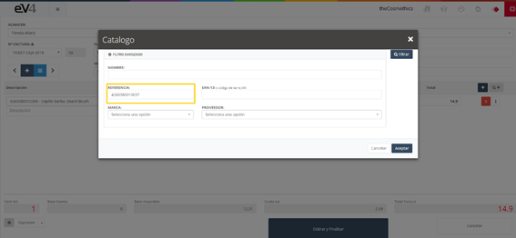

# POS

The POS is the panel for managing sales on the company's premises to a customer in an easy and straightforward manner.

Upon accessing, we find a list of all invoices made, whether manually through the sales section or directly from the POS, along with a filter to make the search easier.

This is the initial view of the "POS" section; by default, the search fields are blank. When we perform a search, the fields will retain the values entered, in case it is necessary to repeat a search related to this data.

If we want to restore the initial state of the template and clear the data from the last search, we can do so by pressing the **“Reset”** button.

## NEW POS

The functionality of this panel is similar to the sales section from the previous part, but in this case, the entire layout is modified for a more user-friendly experience.

Initially, we see the simplified view of the POS screen. If we want to access the full view of this screen, we need to go to the dropdown button **“Options”** located at the bottom right of the screen.

And select the option **“More Info”**. We will see that the fields: **“Due Type”** and **“Due Date”** appear.

First, let’s look at the function of a series of important buttons in the **“New POS”** section:

- **NEW POS Button (+)**: A blue button with a white plus symbol located at the top left of the screen, below the **“INVOICE NO.”** field. Its function is to generate a new ticket, meaning it clears all fields on the screen and resets them to their initial state.

- **List Button**: A light blue button with three white horizontal lines. It is located next to the **“NEW POS”** button. Its function is to return to the initial **“POS”** section.

- **Forward/Back Buttons**: Buttons located to the left and right of the two previous buttons. These buttons allow us to load the previous/next ticket on the screen and navigate between them.

- **Add Item Button**: A smaller blue button with a white plus symbol located at the top right of the screen. The function of this button is to add a new line to the ticket to include another item.

- **Delete Button (x)**: A red button with an "x". This button deletes a product line from the invoice or ticket. If there are more lines than necessary or we want to delete a specific line, we press this button and the line will be removed.

- **Info Button (i)**: A white button with a lowercase "i" inside. The **“INFO”** button provides information about the product related to that line on the ticket or invoice.

If we click on it, a pop-up window will appear with the product information. To close this window, we press the **“OK”** button.

- **Catalog Search Button (Q+)**: A gray button with the **Q+** symbol, located to the right of the **“Add Item”** button. The function of this button is very practical. To add an item to the ticket, if done from the default field, it only allows searching by name. With this button, we can search for an item by the following criteria:
  - **NAME**
  - **REFERENCE**
  - **EAN-13**
  - **BRAND**
  - **SUPPLIER**

### Search by NAME

To search for an item by its name, we type it into the **“NAME”** field.

Press the **“FILTER”** button to display the results.

Now, to add an item to the ticket or invoice, we double-click on it.

Each time we double-click on an item, one more unit of it will be added to the ticket or invoice.

### Search by REFERENCE

We can search by **“REFERENCE”**, type the reference of an item in the corresponding field, and press the **“FILTER”** button.

The system will display the matches.

To add the item to the ticket, we double-click on it.

### Search by EAN-13 (or JAN barcode)

The operation is exactly the same as for the **“REFERENCE”** field.

### Search by BRAND

We can search by **“BRAND”**: Click on the **“BRAND”** field and a dropdown will appear where we can type the brand name for the system to filter the search or select one from the list. Select a brand and press the **“FILTER”** button.

The system will bring up a list of all items from the selected brand that are registered.

To add an item to the ticket, we double-click on it.

### Search by SUPPLIER

We can search by **“SUPPLIER”**: Click on the **“SUPPLIER”** field and a dropdown will appear where we can type the supplier’s name for the system to filter the search or select one from the list. Select a supplier and press the **“FILTER”** button. The system will display a list of all items from the selected supplier that are registered. To add an item to the ticket, we double-click on it.

All these search criteria can be combined to make the search more precise.

### Available Fields in the POS Window

- **Invoice No.**: In this field, we can select the series to which the generated invoice will belong.
- **Client – Add+**: Allows us to select the client for whom the invoice will be issued.
- **Invoice Date**: Allows us to set the invoice date.
- **Due Type**: Allows us to select whether the invoice will be paid in cash or within 30, 60, or 90 days.
- **Due Date**: Allows us to set the invoice's due date.
- **Seller**: Allows us to select the seller to whom the sale will be assigned.
- **Barcode Reference**: Allows us to read the product's barcode using an external scanner or type it manually.
- **Item**: We will have a different line for each item in the invoice.

### Options Available Through the “Options” Button

- **Promotions**: Allows us to select an active promotion.
- **More Info**: Allows us to toggle between the simplified view and the full view in the POS window.
- **Discount**: Allows us to apply a discount to the invoice.
- **Gift Card**: Allows us to charge a gift card to the invoice.
- **Second Payment**: Allows us to set up a second payment for the invoice.
- **Change**: Shows the change to be given to the customer.

Let’s take a closer look at these options:
