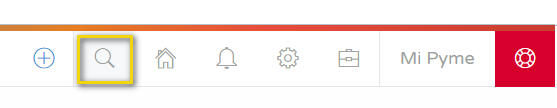
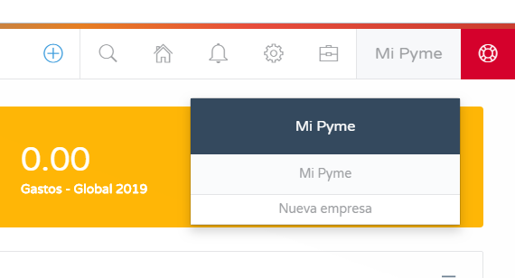
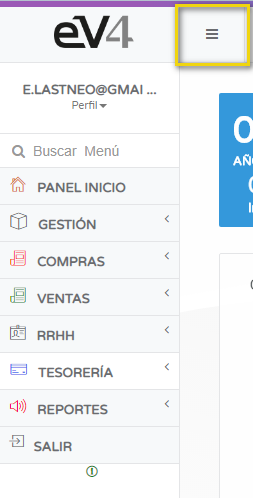
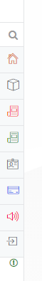

# INTERFACE

**Welcome to eV4ERP, making the complex simple.**  
Our software will allow you to **manage your business** more efficiently.  
Let’s quickly explore the interface of eV4ERP.

---

## TOOLBARS

eV4ERP has **two main toolbars**.

### **1.- TOP RIGHT BAR**  
At the top right of the screen, we have the **quick access bar**, which features **eight buttons** to execute functions with a single click.

These buttons, from left to right, are:

- **More:** Allows you to **create** a new customer, a new sales invoice, a new ticket, a new supplier, a new purchase invoice, or access reports.

- **SEARCH:** Allows you to **search for items, customers, suppliers, etc.** in the database.

When clicked, a window will open to enter the search terms.

- **HOME PANEL:** Takes you directly to the **home panel**.

- **NOTIFICATIONS:** Opens a dropdown panel with the system’s **notifications**.

- **SETTINGS:** Provides access to **7 configuration options** of eV4ERP.

- **TOOLS:** Provides access to **4 tools**, including **synchronization with PrestaShop** (if subscribed), downloading **Anydesk**, checking **tickets and incidents**, and **invitations**.

- **COMPANY:** Allows you to **configure or modify the company details**.

- **SUPPORT:** Red button to **send a support ticket** to the support department.

---

### **2.- LEFT COLUMN**  
In the left column, we find the **navigation menu**, which provides access to all eV4ERP functions.  
This panel can be **expanded or hidden** by clicking the button with **three horizontal lines**.

#### **Menu Items:**  
- **SEARCH BAR:** Allows you to **search for sections** of the menu by typing their name.  
- **HOME PANEL:** Takes you to the **home panel** from any section.  
- **MANAGEMENT:** Allows you to manage the **product catalog**.  
- **PURCHASES:** Manages **suppliers, delivery notes, and purchases**.  
- **SALES:** Manages **customers, orders, delivery notes, quotes, and invoices**.  
- **HR:** Manages **employees, workplaces, and payroll**.  
- **TREASURY:** Manages **cash counts and bank accounts**.  
- **REPORTS:** View **various reports**.  
- **LOG OUT:** Button to **close the application**.

---
