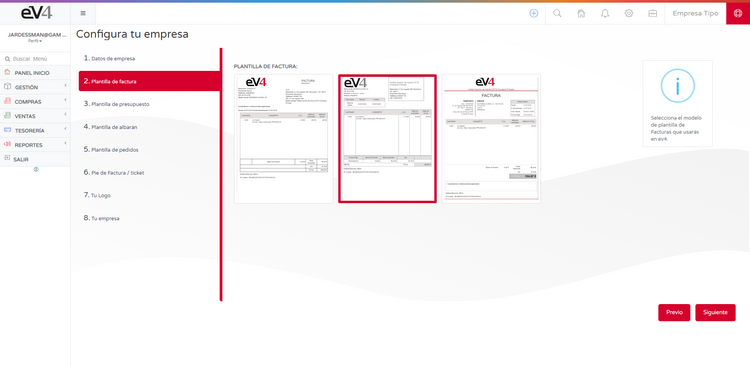
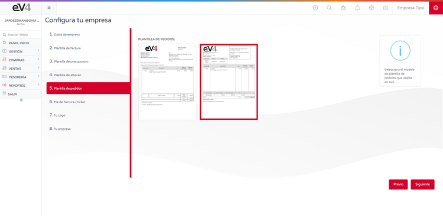

## INITIAL CONFIGURATION

The initial setup assistant allows you to configure the basic aspects of the system in eight steps, quickly and easily.

### 1.- COMPANY DETAILS:

- **COMPANY NAME**: Official name of the company.
- **TRADE NAME**: Trade name of the company.
- **VAT NUMBER**: Tax Identification Number (TIN) of the company.
- **COUNTRY**: The country where the company is registered.
- **PROVINCE**: The province where the company is registered.
- **TAX ADDRESS**: The address where the company is registered.
- **POSTAL CODE**: The postal code of the location where the company is registered.
- **PHONE**: The company’s phone number.
- **FAX**: The company’s fax number.
- **EQUIVALENCE SURCHARGE**: YES/NO. If you enable this option, the corresponding equivalence surcharge will be applied to all sales invoices.

---

### 2.- INVOICE TEMPLATE:

On this screen, you can select the template that the system will use for invoices. Simply click on the chosen template and then click the **NEXT** button.

---

### 3.- QUOTE TEMPLATE:

On this screen, you can select the template that the system will use for quotes. Simply click on the chosen template and then click the **NEXT** button.

---

### 4.- DELIVERY NOTE TEMPLATE:

On this screen, you can select the template that the system will use for delivery notes. Simply click on the chosen template and then click the **NEXT** button.

---

### 5.- ORDER TEMPLATE:

On this screen, you can select the template that the system will use for orders. Simply click on the chosen template and then click the **NEXT** button.

---

### 6.- INVOICE/TICKET FOOTER:

On this screen, you can customize the text that will appear in the footer of invoices, the footer of tickets, and the heading of invoices. Once finished, simply click the **NEXT** button.

---

### 7.- YOUR LOGO:

On this screen, you can add your **Company Logo**. The image size should be **280 x 72 pixels** and in **PNG** format.

To upload the logo:
- Click on the trash can icon to delete the existing image.
- Drag your company logo to this area.
- Click the **NEXT** button.

---

### 8.- YOUR COMPANY:

In this final step, you will see a **summary** of all the settings made.

Now you can check that all the data is correct. If so, click the **FINISH** button. If not, click the **PREVIOUS** button as many times as necessary to go back to the screen where you want to correct the data.

---
