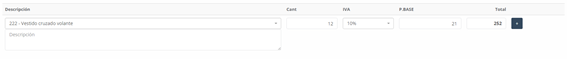
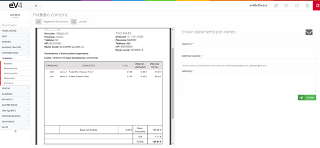

---

title: Orders
description: Orders

---

# **Purchase Orders**

On the **main orders screen**, we can find a list of the different **purchase orders** that have been created in the system. In addition to this list, there is a **filter** to search for orders by **dates**, **warehouses**, **suppliers**, or the **status** of the order.

---

## **Initial View and Filters**

This is the initial view of the **"PURCHASE ORDERS"** section. The **search fields** are initially empty, but once a search is performed, the **entered values** remain to make future searches easier. If we need to reset the initial screen state and clear the data from the last search, we can do so by clicking the **“Reset”** button.

---

## **Orders – New**

To create a **new purchase order**, simply click on the **"New"** button. This will open a form with the following fields to complete:

1. **Invoice No.:**  
   - The invoice number is automatically assigned by the system, but it can be **modified** if necessary by clicking on the **lock**.

2. **Supplier:**  
   - The **supplier** to whom the purchase order is being placed.

3. **Order Date:**  
   - The **date** when the order is placed.

4. **Order Status:**  
   - The **status** of the order.

5. **Note:**  
   - An **informational text** about the generated order.

6. **Auto Order:**  
   - This button adds the corresponding **order lines** based on the selected supplier, minimum order quantities, and available stock.

---

## **Product Table in the Order**

To add products to the order, use the table shown in the following image. The fields to complete are:

1. **Description:**  
   - Select the **product** and optionally add an **additional description**.

2. **Quantity:**  
   - The **quantity** of the product to be ordered.

3. **VAT:**  
   - The **VAT** of the selected product.

4. **Base Price:**  
   - The **price without VAT** of the product.

5. **Total:**  
   - The **total** calculated for the product, considering the quantity, base price, and VAT. This value is **automatically generated**.

---

## **Buttons in the Product Table**

- **"+" Button:**  
  - Allows you to **add another product line** to the order, copying the data from the selected line.

- **"x" Button:**  
  - Deletes the selected line. It's important to note that there must always be at least one product line in the order, so this button will not be available on the first line.

---

## **Additional Fields in the General Form**

1. **Exempt Base:**  
   - The **price base exempt from VAT** is automatically generated when the product fields are filled.

2. **Taxable Base:**  
   - The **taxable base** of the selected products’ price, which is also generated automatically.

3. **VAT Quota:**  
   - The **total VAT** added based on the selected products, automatically calculated.

4. **Invoice Total:**  
   - The **total of the invoice**, automatically calculated from the selected products.

5. **Documents:**  
   - You can **attach documents** to the order, which will be **private** and only available within the system for reference in the order.

6. **Print:**  
   - If **“Yes”** is selected when saving, the system will automatically generate a **PDF of the order**, which can be **printed** or sent by **email**.

---

