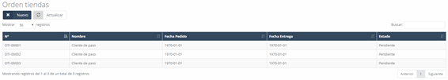
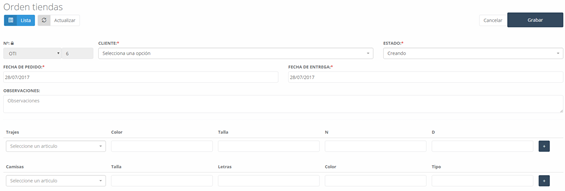

---

title: Store Order
description: Store Order

---

# **Store Orders**

In this section, we can find all the **store orders** that have been managed. When accessing an already created order, we have the option to **print** the order by clicking the **Print** button.

---

## **Initial View and Access to Store Orders**

Once inside the **“Store Orders”** section, we can view all the managed orders, and different actions will be offered, including the option to **print** the selected order.

---

## **Store Orders – New**

To create a **new store order**, we must click the **“New”** button on the initial screen. When doing this, a form will appear, and we must complete the following fields:

### General Fields:

1. **Invoice No.:**  
   - This is the **invoice number** that identifies the order. This number is automatically assigned by the system, but it can be **modified** if needed by clicking the **lock**.

2. **Customer:**  
   - The **customer** associated with the order.

3. **Status:**  
   - The **current status** of the order, which can be one of the following:
     - **Creating**: This is the initial status. The order has not been sent yet and does not appear in the workshop profile.
     - **Sent**: The order has been created and sent, and it is visible in the workshop profile. At this stage, the order is locked in the store profile.
     - **In process**: The order has arrived at the workshop and is being worked on.
     - **Completed**: The order has been finished and is complete.
     - **Incident**: If the order has a problem or unexpected issue preventing its completion.

4. **Order Date:**  
   - The **date** when the order is placed.

5. **Delivery Date:**  
   - The **delivery date** set for the order.

6. **Observations:**  
   - In this field, we can add any **note** or **important observation** related to the order.

---

## **Additional Information for the Order**

After these general fields, a series of additional fields are presented where we must enter the **specific** information needed to complete the order.

---

