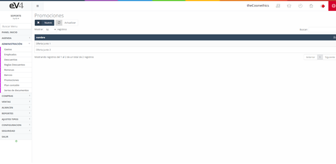
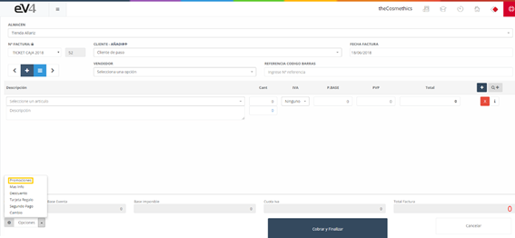
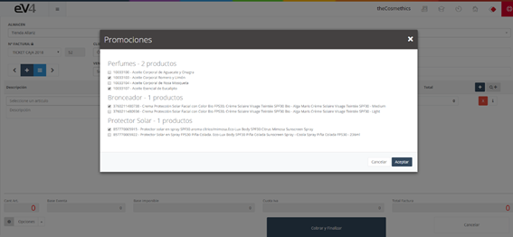
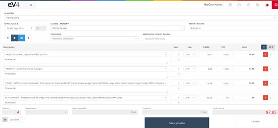

---

title: POS - Promotions
description: Promotions POS

---

Selecting the **“Promotions”** option will open a pop-up window displaying a list of active promotions (if the promotion has expired, it will not be displayed in this pop-up window). Choose the desired promotion, then select the products that will be included in it. This way, the products are automatically added as lines to the sale.

These are the promotions registered in the system. You can check them in the **“Sales – Promotions”** section.

In the **“POS”** view, click the **“Options”** button and select **“Promotions”**.

A pop-up window will appear with the current promotions.

To select a promotion, click on it.

Select the desired products.

Click “Accept,” and the selected products will be added to the invoice.

