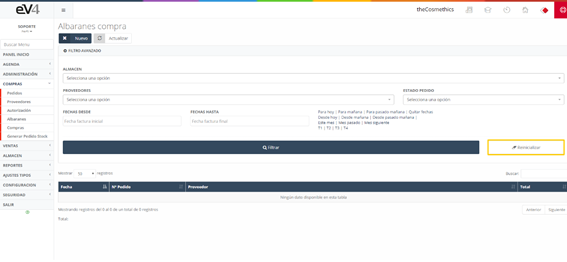
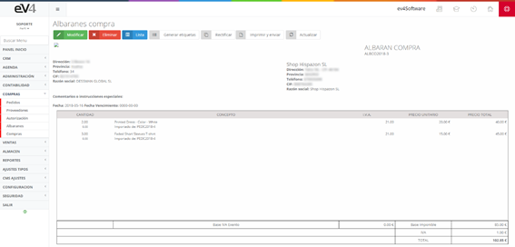

---

title: Purchase Delivery Notes
description: This section contains the delivery notes generated from a purchase order made to a supplier. As explained earlier, we can create the delivery note for the purchase invoice from the orders section or create a new one from the delivery note section in the purchases area.

---

This section contains the delivery notes generated from a purchase order made to a supplier. As explained earlier, we can create the delivery note for the purchase invoice from the orders section or create a new one from the delivery note section in the purchases area.

In the purchase delivery note screen, we find the list of delivery notes and a filter identical to that of the orders. The functionality is the same as used for creating a purchase order, with the difference that this time we are creating a delivery note and not an order.

#### Initial View of the "PURCHASE DELIVERY NOTES" Section

This is the initial view of the **“PURCHASE DELIVERY NOTES”** section. Initially, the search fields are blank by default. When we perform a search, the fields retain the values entered, in case we need to repeat a search related to those data.

If we want to reset the template to its initial state and delete the last search data, we can do so by clicking the **“Reset”** button.

If we click on a delivery note in the list, we will see the following screen.

From this window, we can:

- **Modify** the delivery note by clicking the green **MODIFY** button.
- **Delete** the delivery note by clicking the red **DELETE** button.
- **Go back** to the previous screen by clicking the blue **LIST** button.
- If we click the **CORRECT** button, we will generate a delivery note identical to the current one, but with the same quantity of products in negative, so the sum of both delivery notes' products will be zero.
- If we click the **PRINT AND SEND** button, we will go to the screen in section **6.4.2**.
