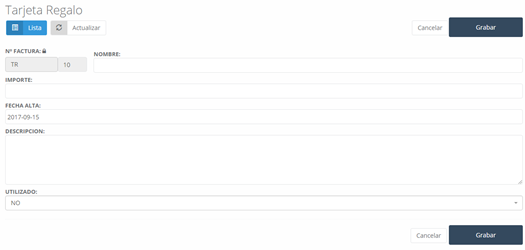

---

title: Gift Cards
description: In this section, we can view the issued gift cards, as well as create new ones.

---

In this section, we can view the **gift cards** that have been issued, as well as create new ones.

## Gift Cards – New

To create a new gift card, simply click the **"New"** button and complete the form with the relevant details:

- **Invoice No.**: This will be the number that identifies the gift card.
- **Name**: The name to be given to the gift card.
- **Amount**: The monetary value that the gift card represents.
- **Creation Date**: The date the gift card was created.
- **Description**: This field allows you to add any important information.
- **Used**: This will indicate whether the card has already been used or not. If it has been used, it will not be possible to use it again in the system.

