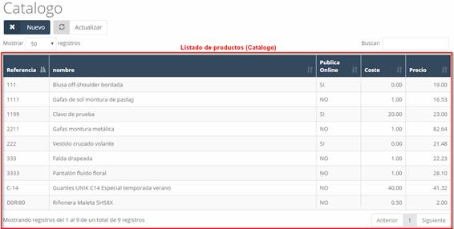
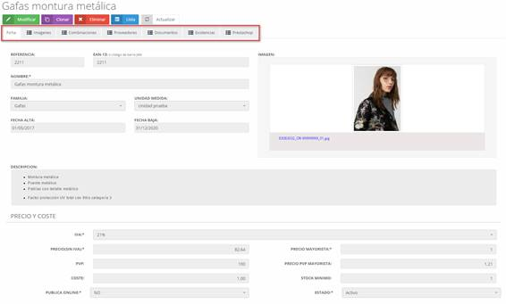
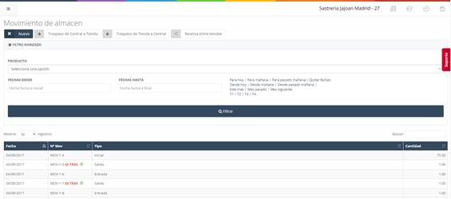

---

title: Stock Movements
description: stock movements.

---

### Stock

When accessing the **catalog**, the main screen will show a list (see Image 78: Warehouse – Catalog) of the products entered into the system (this will initially be empty).

#### Stock - New (Product)

To add a new product to our catalog, click the **new** button on the initial catalog screen (see Image 78: Warehouse – Catalog). This will display a form to be completed with the product information (see Image 79: Warehouse - Catalog – New). The fields to complete are:

- **Reference**: Code to identify the product.
- **EAN-13**: Barcode.
- **Name**: Name of the article or product.
- **Short Name**: Abbreviated name of the article or product.
- **Image**: Product image.
- **Brand**: Brand of the product.
- **Family**: Category or family the product belongs to.
- **Unit of Measurement**: How the product is measured (unit, centimeters, etc.).
- **Date Created**: The date from which the product will be available.
- **Date Removed**: The date from which the product will no longer be available.
- **Description**: Detailed description of the product.
- **VAT**: VAT applied to the product.
- **Price (ex VAT)**: Price of the product excluding VAT.
- **RRP**: Recommended retail price.
- **Cost**: Cost of the product.
- **Publish Online**: Indicates if the item will be visible in the online store (Prestashop).
- **Wholesale Price**: Wholesale price of the product.
- **Wholesale RRP**: Retail price for wholesalers.
- **Minimum Stock**: The number of items at which the system will consider the product “out of stock” or low in stock.
- **Status**: The product's current status.

Once the form is filled out, click the **save** button to store it in the system.

#### Stock – Modify (Tabs)

To modify an existing product in the catalog (see Image 78: Warehouse – Catalog), click on the product you want to modify. This will display a new screen (see Image 80: Warehouse - Catalog – Modify) with several tabs associated with the product.

To modify any of the fields in the product's tabs, click the **modify** button first, and then click **save** to save the changes.

#### The tabs we find in a product when modifying it are:

- **Sheet**: Contains all the main information about the product (see Image 80: Warehouse - Catalog – Modify).
- **Images**: Contains the images associated with the product. It also allows you to add new images.
- **Combinations**: Allows you to configure and combine products by attributes.
- **Suppliers**: Contains the suppliers associated with the product, as well as the ability to add a new supplier.
- **Documents**: Contains documents associated with the product. It also allows you to attach new documents to the product.
- **Stock**: Number of products available. Within this tab, we can find the minimum stock and the available quantity of the product, classified by its combination, i.e., by its group of attributes. Additionally, in the *Quantity Orders* field, we can see the amount of the product that is under order, which will go to zero when the related delivery note is created, and will be added to the stock field.
- **Prestashop**: Synchronizes the item with Prestashop if it has been previously activated for synchronization in the Sheet tab.

---

#### Movements

In this section of the system, we find a list of movements related to the warehouse, such as the entries and exits of items (see Image 81: Warehouse - Movements - Movement List). We can also filter movements by dates or products.

#### Movements – New

To create a new movement, click the **new** button on the main movements screen (see Image 81: Warehouse - Movements - Movement List). This will display a new screen with several fields to complete (see Image 82: Warehouse - Movement - New).

## Fields to Complete:

- **Movement No.**: By default, this field is locked, so it is necessary to unlock it by clicking the lock icon. It corresponds to the movement identifier.
- **Movement Type**: Indicates the type of movement.
- **Date**: The date when the movement was made.
- **Note**: Informational note about the movement.
- **Description**: Product and description.
- **Quantity**: The amount of the product.
- **VAT**: VAT applied to the product.
- **Base Price**: Base price of the product.
- **Total**: Total price for the quantity of products.
- **Add Button**: Allows you to add a new line of products.
- **Exempt Base**: Base price excluding VAT.
- **Taxable Base**: Amount of taxable income.
- **VAT Amount**: Associated VAT amount.
- **Total Invoice**: Total invoice amount.

Once the fields are completed, click the **save** button to record the new movement in the system.
