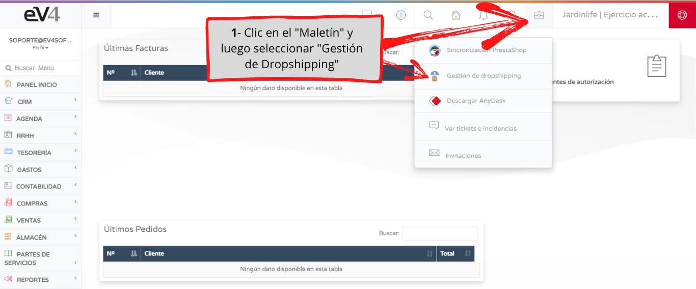
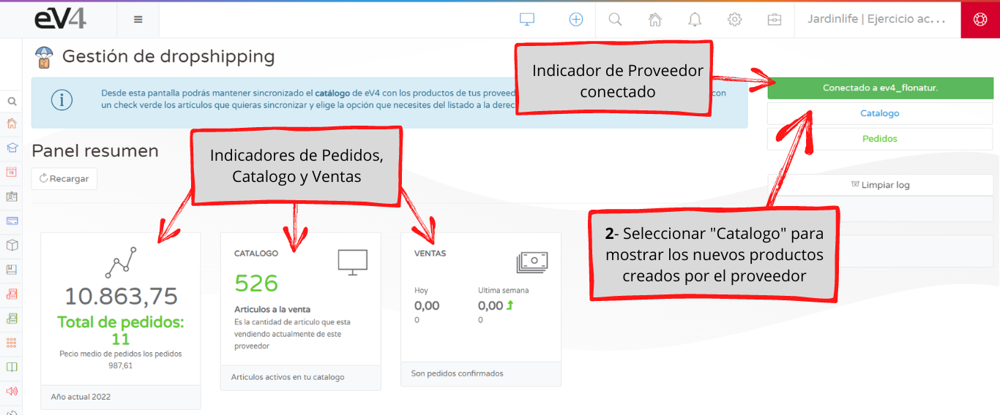
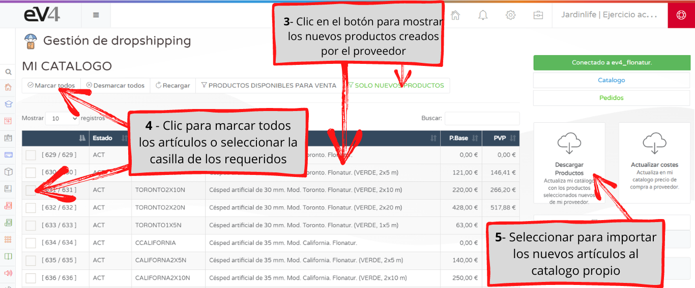

---

title: Synchronization of Products in Dropshipping

---

What to do when the dropshipping supplier adds new items to their catalog? We’ll show you in simple steps how to incorporate new products into the dropshipping seller catalog in eV4, synchronizing them automatically.

