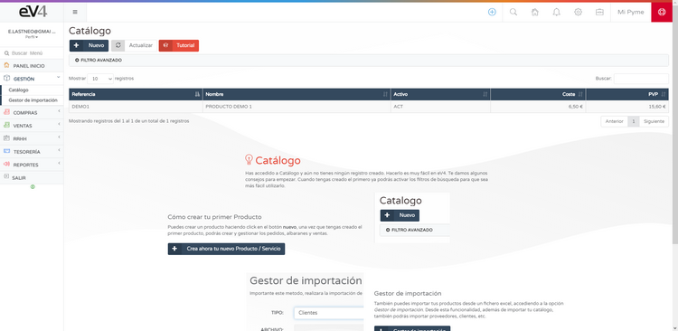
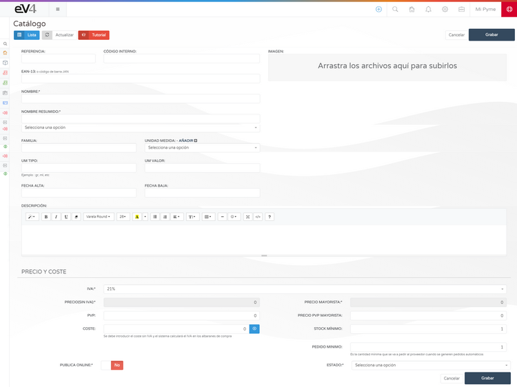

# Creating and Importing Items into Inventory  

To start selling, you first need to have inventory.  
You can create items for your inventory manually from the section:  

**MANAGEMENT → CATALOG**  

## Manual Creation of Items  

By clicking the **NEW** button, the product form will open for you to complete with the necessary information.  

## Importing and Exporting the Catalog  

You can also **import/export** the catalog from Excel files using our **IMPORT MANAGER**.  

**Recommendation:** It is recommended to use the provided template for better control over the data being imported.  

Once you have created or imported your products, you can start **creating and managing orders, delivery notes, and sales**.  

## Exporting the Catalog  

You can **export** your catalog in its entirety or partially, depending on your needs.  

---

Once your inventory is set up, you'll be ready to manage your sales efficiently. 🚀  
