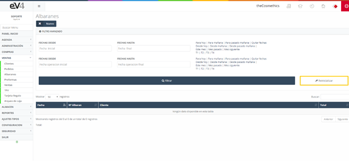
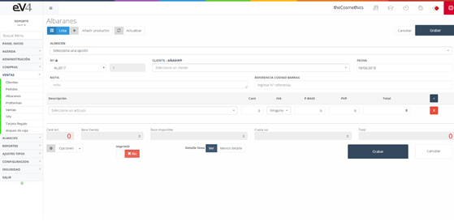
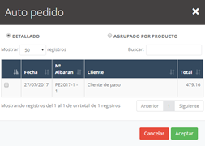
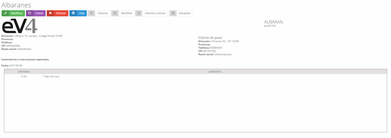

# Delivery Notes

Delivery notes are generated from sales orders, but they can also be created without the need for the previous step if necessary.

In the main screen, we can see a list of all existing delivery notes, as well as a small filter to help search for them.

---

## Initial View

This is the initial view of the **"SALES DELIVERY NOTES"** section.  
By default, the search fields are empty.  
When a search is performed, the fields will retain the entered values, in case you need to repeat a search related to that data.

If we want to reset the search and clear the last search data, we can do so by clicking the **"Reset"** button.

---

## Creating a New Delivery Note

To create a new delivery note, we can do it in two ways:  
1. From a **sales order**, as explained earlier.  
2. By creating a **new one**, filling in the form fields, where we will enter a **customer** instead of a supplier.

In the **new delivery note** form, there is a **"Orders"** button.  
Clicking on it will open a pop-up window with the **orders of the selected customer** in the form.

- We select the orders we want to import and click **Accept**.  
- All the lines from the selected orders will be automatically imported into our delivery note.

---

## Delivery Note Features

Once a delivery note is generated, we will have the same buttons as in a **purchase delivery note**, such as **rectify and print**.  
However, in this case, there will be a new button:

### **Invoice**  
- This allows us to **create the invoice** for the customer from the delivery note.

### **Apply Discounts**  
- Just like in orders, we can apply discounts from the **"Options"** drop-down menu.  
- A **discount percentage** is entered in the pop-up window.

