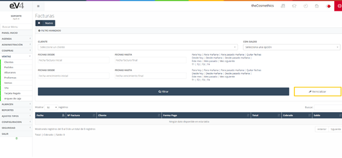
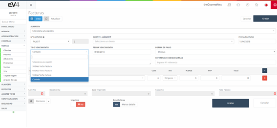

# Sales

Sales are generated when customers purchase products from our company.  
Upon logging in for the first time, we see a list of all generated sales, along with a small filter to help with their search.

---

## Initial View 

This is the initial view of the **"INVOICES"** section.  
Initially, the search fields are empty.  
When a search is performed, the fields will retain the entered values, in case you need to repeat a search related to that data.

If we want to reset the search and clear the last search data, we can do so by clicking the **"Reset"** button.

---

## Creating a New Invoice  

To create a new sale: 

1. Select the **WAREHOUSE**.  
2. Enter the invoice series in the **"INVOICE NO."** field.  
3. Choose the **CUSTOMER** to whom the invoice is issued.  
4. Assign the **INVOICE DATE**.  

The **"DUE TYPE"** field allows us to select:  
- **Cash**,  
- **30, 60, or 90 days**.

---

The **"DUE DATE"** field allows you to assign the date when the invoice should be paid.  

In the image, we can also see the **"PAYMENT METHOD"** field.  
Clicking on it, we can select the payment method for the invoice.

---

### Adding Products 

To quickly add products to the invoice:  
- We can scan the **barcode** of the product using a reader.  
- This will automatically bring in the product with its details.  
- We can also click the **"LINE DETAIL"** button to add additional information to the product.

To **print** and **send** the invoice, we follow the same process as in previous sections.

---

## Importing Delivery Notes to an Invoice  

In the **new SALE/INVOICE** form, we find a **"Delivery Notes"** button within the **"Options"** dropdown menu.

 

Clicking it will open a pop-up window with the **delivery notes of the selected customer** in the form.  

- We select the delivery notes we want to import and click **Accept**.  
- All the lines from the selected delivery notes are automatically imported into the invoice.

---

## Additional Features

### Applying Discounts  
From the **"Options"** dropdown menu, we can apply discounts.  
Clicking the option will open a pop-up window where we enter the **discount percentage**, which will be applied to the total price.

### Accessing the Agenda  
It is possible to access the **agenda** from the **new invoice** screen.  
This allows us to **schedule an appointment** with the customer directly.

---

## Collecting Payment for an Invoice

Once the invoice is generated, the view will show a new button **"Collect Invoice"**.

To **collect the payment for the invoice**, click the button, and a window like the following will appear:

  

In the **"Collect Invoice"** window, we find two tabs:  
1. **Payment:** Here, we enter the **payment method** details for the customer.  
2. **Transactions:** Shows a list of **payments made** toward that invoice.
