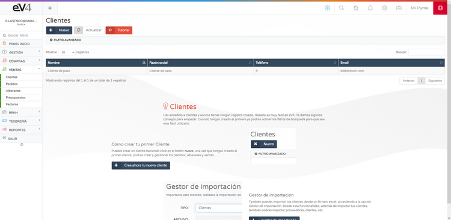
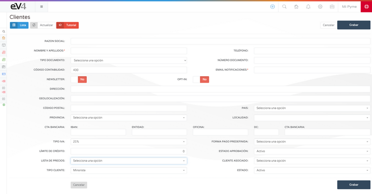

# How to Start Selling in eV4ERP

To start selling, you need to have customers.  
eV4ERP comes with a default **TEMPORARY CUSTOMER**.

You can manually add customers from the section:  
**SALES → CUSTOMERS**.

---

By clicking the **NEW** button, the customer form will open for you to complete.

---

You can also import/export the customer portfolio from Excel files using our **IMPORT MANAGER**.

We recommend using the provided template for better control over the data being imported.  
Once you have created or imported your customer portfolio, you can start creating and managing orders, delivery notes, and sales.

---

You can export your customer portfolio from the **EXPORT MANAGER**.

---

Once you have created or imported your customers, you can start creating and managing orders, delivery notes, and sales.
