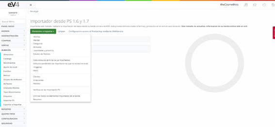
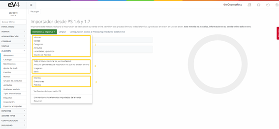

# Import PS into eV4ERP  

In this section, we can import databases from the online store to **eV4ERP**.  

---

## Import Options  

In the dropdown, we have **5 blocks of options**:  

- **Block 1:** Languages, Brands, Categories, Attributes, Localities and Provinces, Order Statuses.  
- **Block 2:**  
  - All Products (*removes already imported ones*).  
  - Pending Products (*will import those not yet in eV4*).  
  - Images.  
  - Stock.  
- **Block 3:** Customers, Addresses, Orders.  
- **Block 4:** PS Import Verification.  
- **Block 5:**  
  - Delete all imported items from the store.  
  - Summary.  

---

## Import Procedure  

To minimize possible issues with the import, it is recommended to do it **sequentially and descending by blocks**.  

### Recommended steps:  

1. **Languages**  
2. **Brands**  
3. **Categories**  
4. **Attributes**  
5. **Localities and Provinces**  
6. **Order Statuses**  
7. **All Products** (*removes already imported ones*)  
8. **Pending Products** (*imports those not in eV4*)  
9. **Images**  
10. **Stock**  
11. **Customers**  
12. **Addresses**  
13. **Orders**  

---

## Import Features  

### **PS Import Verification**  
- Compares the records from the online store with those imported into eV4ERP and verifies if they match.  

### **Delete all imported items from the store**  
- Deletes records from **eV4ERP** that came from the online store.  
- **Important:** Our software **does not alter** the records in the online store, it only copies them and works on them within eV4.  

### **Summary**  
- Provides a summary of the number of records imported.  

---

## Important Note  

This method **imports data from your online store into eV4ERP**, deleting all families and products previously imported into **eV4ERP**.  

**This process does not update information in your online store, only in eV4ERP.**  
**eV4ERP differentiates between records created within the system and those imported from PrestaShop.**  
