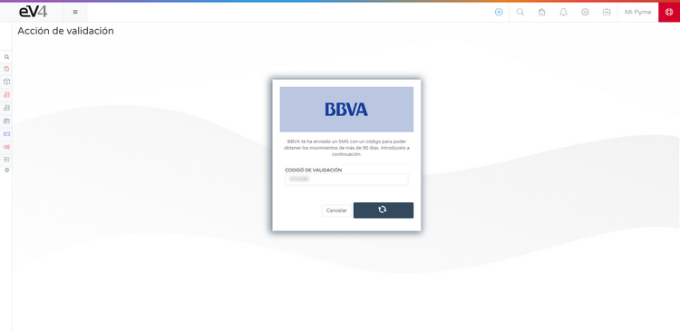
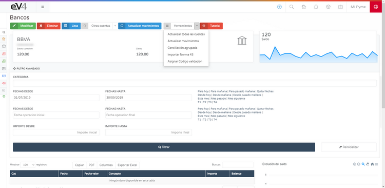
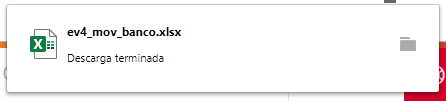
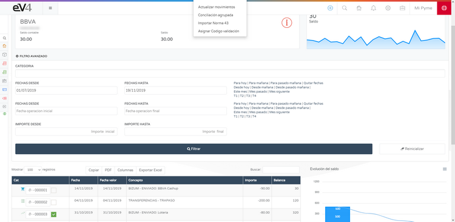
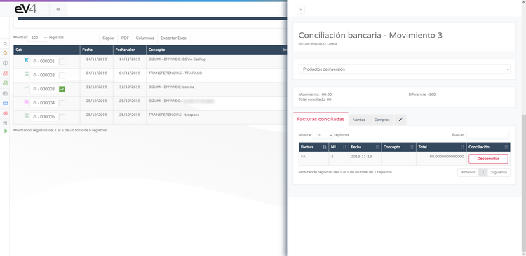
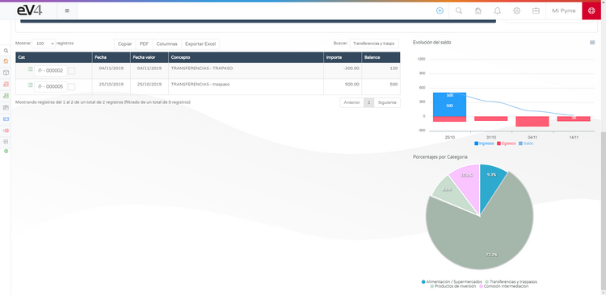

# Connect to Your Bank in eV4ERP  

eV4 allows you to connect to your bank to view your bank transactions.  
**eV4 only has read-only access to your bank data**, meaning it can only view this data.  
**It will never be able to perform financial transactions** (*payments, transfers, etc.*).  

**Location of the function:**  
Menu **TREASURY → BANKS**.  

---

## Connect to Your Bank  

The first time you access, you will see the following screen.  

1. Click the button **CONNECT TO YOUR BANK**.  
2. A screen will appear where you need to select your **bank entity**.

3. eV4 can work with **over 100 banking entities** from Europe and America.  
   - You can filter banking entities by **country** or search directly by **name**.  
   - Once found, click on it.  

4. eV4 adapts to the working method of each bank and will ask for the required data for the selected entity.  

5. Enter the required data and click **CONNECT**.  

---

## Download Transactions  

- The first time **eV4** connects to your bank, it will request transactions from the **last year**.  
- To request transactions for periods longer than **90 days**, according to European regulations, your bank will provide a validation code that you need to enter.

- Click **VALIDATE** and wait for the process to finish.  
- The **available accounts** from the banking entity will be displayed on the screen.

---

## Handling Accounts with Errors  

If an account has a **red symbol** with an "i" inside a circle, it means it requires user action.  

1. Click on the account to access it.  

2. Follow the instructions and click **CLICK TO REACTIVATE ACCOUNT**.  

3. Wait for the process to complete.  

---

## Available Tools  

At the top of the screen, you'll find the **TOOLS** menu with the following options:  

- **UPDATE ALL ACCOUNTS** → Updates transactions for all accounts.  
- **UPDATE TRANSACTIONS** → Updates transactions for the selected account.  
- **GROUPED RECONCILIATION** → Allows reconciling transactions with invoices.  
- **IMPORT NORM 43** → Imports the Norm 43 file provided by the bank.  

- **ASSIGN VALIDATION CODE** → When reactivating an account, allows you to enter the validation code.  

You also have the **OTHER ACCOUNTS** menu to switch between accounts without returning to the banks screen.

---

## Filter Transactions  

Once the transactions are downloaded, you can filter by the desired time period using the **ADVANCED FILTER**.  

Above the transaction list, you'll find 4 buttons:  

- **COPY** → Copies all transactions to the clipboard.  
- **PDF** → Generates a PDF document with the transactions.  

- **COLUMNS** → Allows you to select which columns to display in the list.  

- **EXPORT TO EXCEL** → Generates a spreadsheet with the transactions in EXCEL format.  

---

# Bank Reconciliation  

Bank reconciliation is a key part of **treasury management** for the company.  
It involves justifying each bank transaction with its corresponding operation (*invoice, income, expense, etc.*).  

### **How to reconcile a transaction with an invoice**  

1. **Select a transaction** by checking the box to the right of the number.  
2. Go to the **TOOLS** menu and select **GROUPED RECONCILIATION**.  

- If no transaction is selected, the system will display an error message.  

3. A screen will open with different categories of transactions.  

**Classification of transactions by tabs:**  

- **RECONCILED INVOICES** → Invoices already reconciled with this transaction.  
- **SALES** → Sales invoices available in the system.  
- **PURCHASES** → Purchase invoices available in the system.  
- **ASSISTANT** → Invoices suggested by the system as related to the transaction.  

### **Reconciling a transaction**  

1. Select the appropriate invoice (*sale, purchase, or suggested*).  
2. Click the **RECONCILE** button.  

3. The invoice will appear in the **RECONCILED INVOICES** tab.  
4. If you want to release the invoice, click **UNRECONCILE**.  

---

## Interactive Charts  

On the right side of the screen, you'll find interactive charts:  

- **Bar Chart** → You can enable/disable **INCOME, EXPENSES, and BALANCE** by clicking on their names.  
- **Pie Chart** → Each category of transaction has a color.  
- Clicking on a section will filter the transactions for that category.  
- To return to the full list, click on the category legend.  

---

# Important Note  

- **This method will import data from your online store to eV4ERP.**  
- **This process will delete all families and products in eV4 if they were previously imported.**  
- **This method DOES NOT update information in your online store, only in eV4ERP.**  
- **eV4ERP differentiates between records created in eV4 and records imported from PrestaShop.**  
