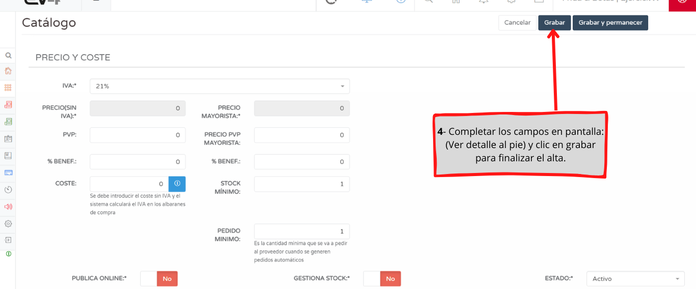

# Tutorial: Manual Item Registration

In this tutorial, we will show you how to manually register an item.  
To learn the procedure for bulk item registration, refer to **"Import from Excel Files"**.

---

## Fields to Consider

#### REFERENCE  
- It is mandatory and unique for each item and should never be modified.  
- Create it in such a way that it easily identifies the item.  
- **Example:** `AL001`.

#### INTERNAL CODE  
- Also used to identify the product, but not mandatory.  
- It can be used, for example, as a supplier reference.

#### EAN-13  
- Enter the barcode of the item.  
- Can be entered manually or scanned using a barcode reader, positioning the cursor in the field.

#### NAME  
- Enter the name of the item.  
- It is mandatory and can be modified at any time.

#### SHORT NAME  
- Abbreviated name of the product that will appear on the receipt.

#### LOCATION  
- Enter, if applicable, the location of the item in the warehouse.  
- **Example:** `Aisle 2 Shelf 4`.

#### BRAND  
- Select the brand of the item.  
- It must be previously registered in the system. *(It can be added from "ADD +")*.

#### UNIT OF MEASURE  
- Select the unit of measure for the item.  
- It must be previously registered in the system. *(It can be added from "ADD +")*.

#### VALUE  
- Enter the corresponding value.  
- This applies for printing labels for chemical products or their derivatives.

#### TYPE  
- Enter the corresponding type.  
- This applies for printing labels for chemical products or their derivatives.

#### FEATURED IMAGE  
- Enter the image of the item.

#### FAMILY / CATEGORIES  
- Select the family or categories if applicable.  
- It must be previously registered in the system under **FAMILIES**.

---

## Accounting and Management Data

#### ACCOUNTING / PURCHASE ACCOUNT  
- Select the accounting accounts if a chart of accounts has been entered previously.  
- Or leave the default accounts defined by **eV4**.

#### REGISTRATION DATE  
- Enter the registration date of the item in **eV4**.

#### CANCELLATION DATE  
- Enter the date to discontinue the item.

#### DESCRIPTION  
- Write a description of the item if needed.

## Pricing and Billing

#### VAT  
- Select the appropriate VAT for the item.

#### PRICE EXCLUDING VAT  
- Enter the price excluding VAT for the item. *(This is automatically calculated based on the PVP depending on the configuration).*

#### RRP (Recommended Retail Price)  
- Enter the retail price of the item, including VAT. *(This is automatically calculated based on the PRICE EXCLUDING VAT depending on the configuration).*

#### % PROFIT  
- Enter the profit margin percentage from selling the item.

#### WHOLESALE  
- Same as **PRICE EXCLUDING VAT**, **RRP**, and **% PROFIT**, but for wholesale prices.  
- **eV4** allows for both prices per item.

#### COST  
- Enter the cost of the item.

---

## Stock Control and Publishing

#### MINIMUM STOCK  
- Enter the minimum stock quantity that the item must have.

#### MINIMUM ORDER  
- Enter the minimum quantity desired for each order to be placed.

#### PUBLISH ONLINE  
- Select **YES/NO** to enable the item on the online store.

#### MANAGES STOCK  
- Select **YES/NO** to configure whether the item adjusts its movements to the stock entered in the system.

#### STATUS  
- Drop-down menu to select the status of the item.
