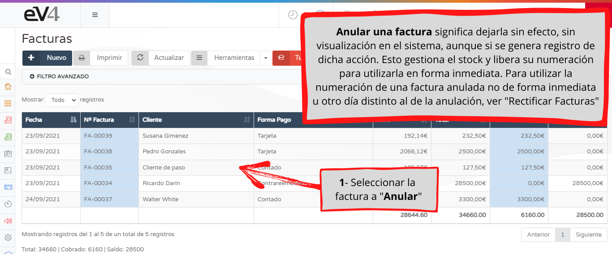
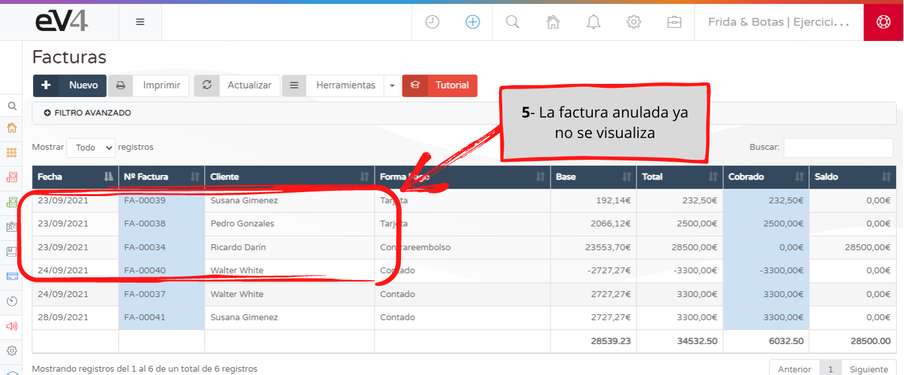
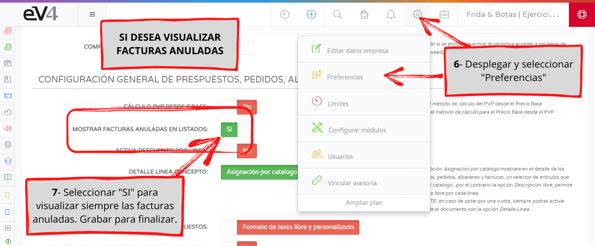
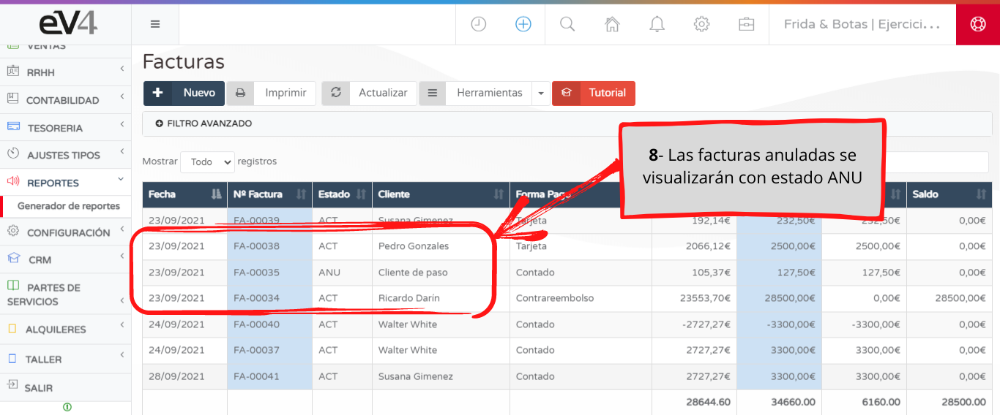

Canceling an invoice means making it void, so it no longer appears in the system, although the action itself is still recorded in ev4. This manages the stock and releases its numbering for immediate use. To use the numbering of a canceled invoice immediately or on a different day from the cancellation date, see "Rectify Invoices".

