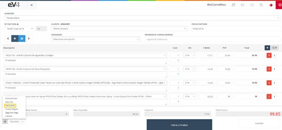
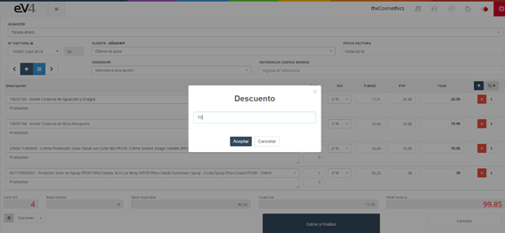
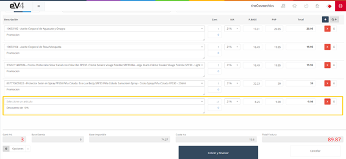

# Discounts

The "**Discount**" option allows us to apply a discount to the invoice.

Image 146: POS – Discounts 1

Click on the "Options" button and select "Discount."

Image 147: POS – Discount 2

A pop-up window will appear where we can specify the discount percentage on the total invoice amount. Click the "Accept" button, and a new line will be added to the invoice with the discount amount.

Image 148: POS – Discounts 3

[Apply discount on items in POS](https://www.loom.com/share/def3ff89853f43bb92a761265fa1a444?sid=b87599a2-9d55-4516-b970-1b1caedafde5)
