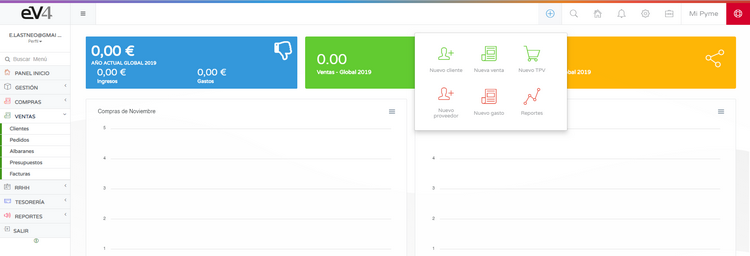
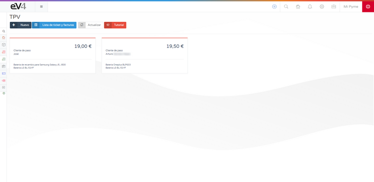
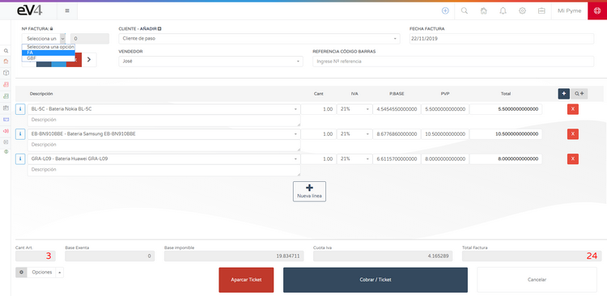
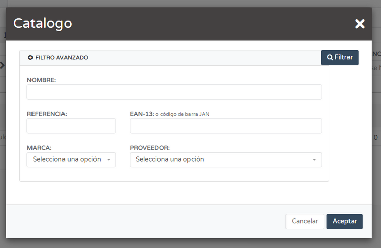
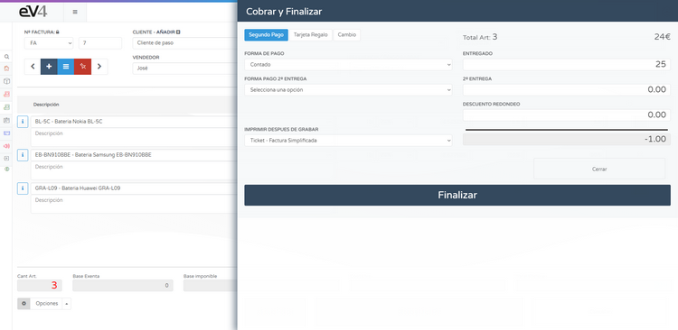

# We made the first sale. Let's create the first ticket.

The fastest way to create a ticket is by clicking the **ADD** button (blue button at the top right of the screen) and then clicking the **NEW POS** button.

## POS

Click the **NEW POS** button, and the screen to create the ticket will appear.

You need to select the **SERIES**, **CLIENT**, **DATE**, and **SELLER**.

To add a product, you can scan its barcode if you have a scanner. Click on the **BARCODE REFERENCE** field, and when the field turns blue, you can either manually type the reference or use the scanner.

To search for an item by name, click on the **SELECT AN ITEM** field. A search bar will open where you can type the name, and all matching items will appear below.

### Invoice Options

- To add a new line to the invoice, click the **+ NEW LINE** button in the center of the screen or the blue button with the **+** symbol on the left side of the screen.
- To delete a line from the invoice, click the red button with an **X** inside.
- The gray button containing **Q+** opens an advanced search that allows you to filter items by: **NAME**, **REFERENCE**, **EAN-13**, **BRAND**, and **SUPPLIER**.

### Action Buttons

- The red **PARK TICKET** button allows you to “save” a ticket without completing the payment process, so you can continue billing and later retrieve it exactly as it was “parked” to finish the payment.
- The **CANCEL** button discards the ticket and returns you to the ticket listing screen.
- Click the **PAY AND FINALIZE** button, and a window will open where you can select the payment method, enter the amount given, and calculate the change by deleting the default values (0.00) and inputting the actual amount.

To complete the operation, click the **FINISH** button.

### Quick Access

- The light blue button with three horizontal lines at the top right of the screen will take you to the list of tickets stored in the system.

- The red **PARKED TICKETS** button at the top of the screen shows the “parked” tickets.

### Retrieving Parked Tickets

To retrieve a “parked” ticket, simply click on it, and it will load on the screen.

The ticket will load in the same state as it was before being “parked,” except for one detail: the series must be assigned manually. When a ticket is “parked,” it is saved without a series assigned.

The last two tickets in the list do not have a series assigned because they are “parked” tickets.

Tickets **reduce stock**.
