# Charge and Finish

Let's take a detailed look at the different functions of the **“Charge and Finish”** button.

When we have finished adding all the items to the invoice and want to proceed with the payment, we simply need to press the **“Charge and Finish”** button, and the following screen will appear.

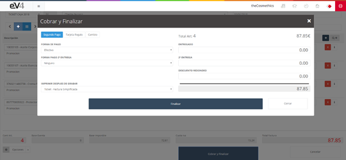

Image 157: Charge and Finish 1

## Available Functions

In the top left, we have three buttons:

- **Second Payment**: Allows us to set up a second payment for the invoice.

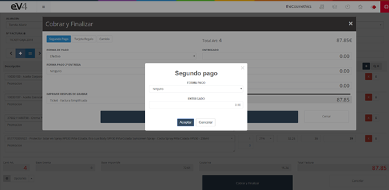

Image 158: Charge and Finish 2

- **Gift Card**: Allows us to use a gift card stored in the system.

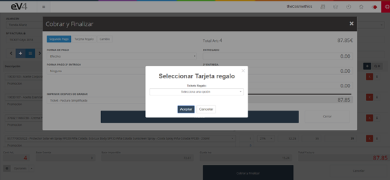

Image 159: Charge and Finish 3

- **Change**: Shows the change to be given back to the customer if they provide an amount higher than the total of the invoice.

We also have the following fields to configure different aspects of the invoice:

- **Payment Method**: Allows us to set the payment method.

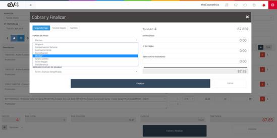

Image 160: Charge and Finish 4

- **Second Payment Method**: Allows us to set the payment method for the second payment.

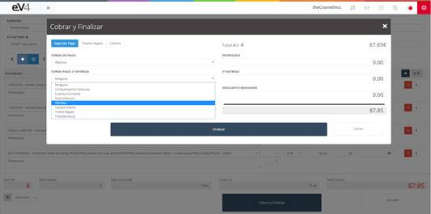

Image 161: Charge and Finish 5

- **PRINT AFTER SAVING**: If we select **“Ticket - Simplified Invoice”**, after pressing the **“Finish”** button, a window will appear with the Ticket from which we can print it by pressing the **“Print”** button.

Image 162: Charge and Finish 6

## Entering the Amount to be Charged

Let's see how to enter the amount to be charged:

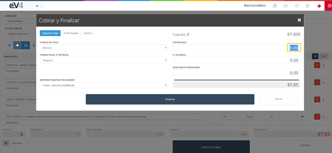

Image 163: Charge and Finish 7

1. Place the cursor over the **“AMOUNT PAID”** field, highlight the amount **0.00**, and press the **delete** button.

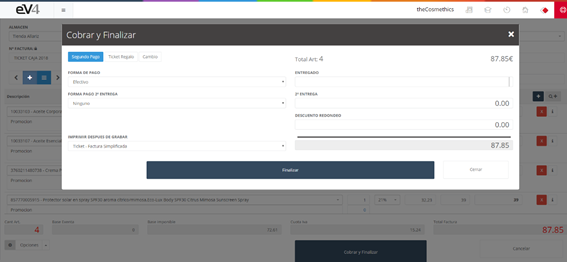

Image 164: Charge and Finish 8

2. At this point, the field will be empty, and we can type the amount paid by the customer.

Image 165: Charge and Finish 9

3. We can apply a rounding discount if we don’t want to charge the cents to the customer. To do this, we enter the amount we want to discount in negative in the **“ROUNDING DISCOUNT”** field.

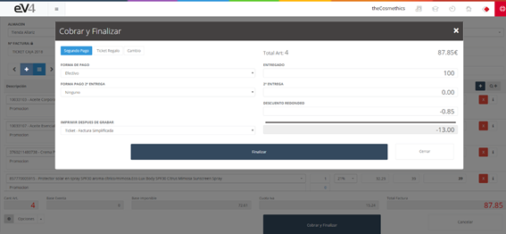

Image 166: Charge and Finish 10

4. We can see how the change has been recalculated.

Image 167: Charge and Finish 11

If we press the **“Change”** button, it will give us a breakdown of the bills and coins to be returned.

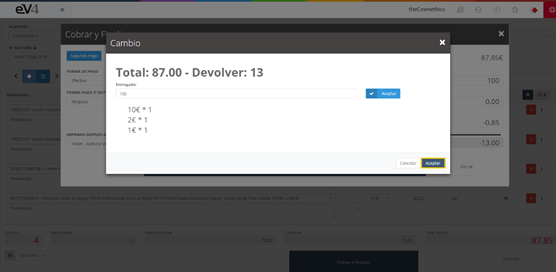

Image 168: Charge and Finish 12

To close this pop-up window, press the **“Accept”** button located at the bottom right of the window.

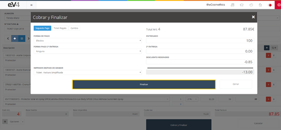

Image 169: Charge and Finish 13

## Finalizing the Sale

To finalize the sale and register it in the system, we just need to press the **“Finish”** button.

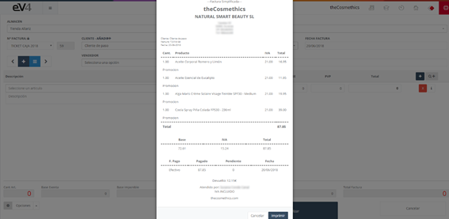

Image 170: Charge and Finish 14

Once the operation has been saved, the ticket will appear on the screen, and we will have the option to print it if needed.

If we press the **“Print”** button, the browser's print window will open, where we can configure the print settings and initiate printing.

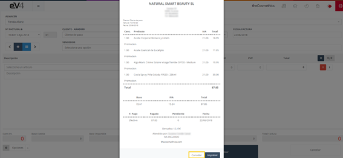

Image 171: Charge and Finish 15

After printing, press the **cancel** button to close this window, and we will return to the **“NEW TPV”** section to continue invoicing.

## General View of the TPV Section

In the general view of the **“TPV”** section, by default, only the tickets/invoices generated on the current day appear. If we want to see those from previous days, we can do so using the filters.

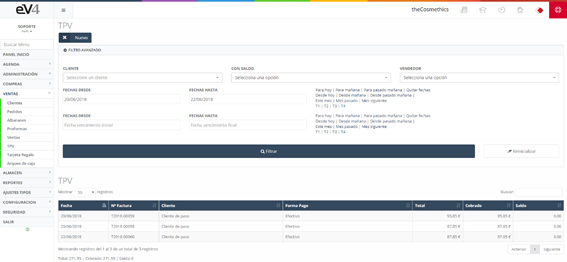

Image 172: General View TPV

The rest of the operation is similar to sales, both in terms of collecting the invoice, generating it, and printing or sending it by email. Even the view is the same.

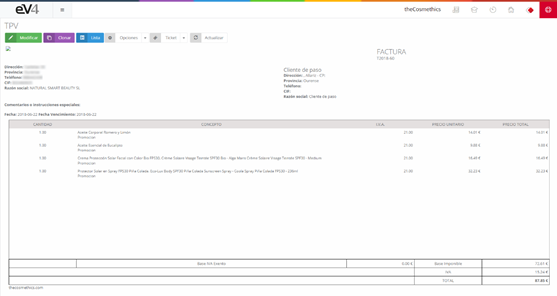

Image 173: General View TPV
