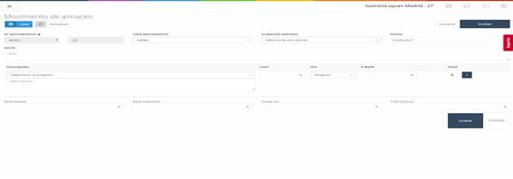

# **Movements – Transfer from Central to Store**

To perform a **transfer** of one or more items from the **central warehouse** to the **store**, click on the **"Transfer from Central to Store"** button on the initial **Movements** screen. This will take you to a new screen with several fields to complete.

---

## **Fields to Complete in the Transfer from Central to Store**

1. **Movement No.:**
   - By default, this field is **locked**. To unlock it, click on the **lock** icon next to it.  
   - This field represents the **identifier of the movement**.

2. **Movement Type:**
   - Indicates the **type of movement** being performed.

3. **Destination Warehouse:**
   - The warehouse where the **items** will be sent.

4. **Date:**
   - The **date** on which the movement was made.

5. **Note:**
   - An **informative note** about the movement.

6. **Description:**
   - The **product** and its respective **description**.

7. **Quantity:**
   - The **quantity** of a product in the transfer.

8. **VAT:**
   - The **VAT** associated with the product.

9. **Base Price:**
   - The **base price** of the product.

10. **Total:**
    - The **total price** of the indicated quantity of products.

11. **Add Button:**
    - Allows you to **add a new product line** to the transfer.

12. **Exempt Base:**
    - The **base price exempt from VAT**.

13. **Taxable Base:**
    - The **amount of income** generated.

14. **VAT Quota:**
    - The **VAT associated** with the transaction.

15. **Invoice Total:**
    - The **total price** of the invoice.

---

## **Movements – Transfer from Store to Central**

To perform a **transfer** of one or more items from the **store** to the **central warehouse**, click on the **"Transfer from Store to Central"** button on the initial **Movements** screen. This will take you to a new screen with the following fields to complete.

---

## **Fields to Complete in the Transfer from Store to Central**

1. **Movement No.:**
   - Just like in the transfer from central to store, this field is **locked** by default. To unlock it, click on the **lock**.  
   - This is the **identifier of the movement**.

2. **Movement Type:**
   - Indicates the **type of movement**.

3. **Origin Warehouse:**
   - The warehouse from which the **items** will be sent.

4. **Date:**
   - The **date** on which the movement was made.

5. **Note:**
   - **Informative note** about the movement.

6. **Description:**
   - The **product** and its respective **description**.

7. **Quantity:**
   - The **quantity** of a product to be moved.

8. **VAT:**
   - The **VAT** associated with the product.

9. **Base Price:**
   - The **base price** of the product.

10. **Total:**
    - The **total price** of the indicated quantity of products.

11. **Add Button:**
    - Allows you to **add a new product line** to the transfer.

12. **Exempt Base:**
    - The **base price exempt from VAT**.

13. **Taxable Base:**
    - The **amount of income** generated.

14. **VAT Quota:**
    - The **VAT associated** with the transaction.

15. **Invoice Total:**
    - The **total price** of the invoice.

---
