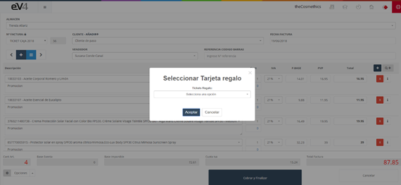

---

title: POS - Gift Cards
description: Gift Cards POS

---

The **“Gift Card”** option allows us to redeem a gift card registered in the system. The creation of Gift Cards will be explained in more detail in section **7.8 Gift Card** of the manual.

Click on the **“Options”** button and select **“Gift Card”**.

A pop-up window will appear where we can choose the customer's gift card from the ones registered in the system. Click the **“Accept”** button, and a new line will be added to the invoice with the discount amount applied.

