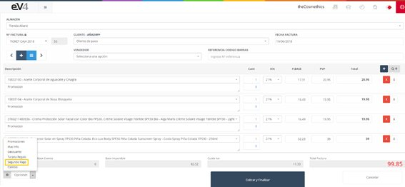

---

title: POS - Second Payments
description: Second Payments POS

---

The **“Second Payment”** option allows us to split the payment of the invoice into different payment methods within a single transaction. For example, if a customer wants to pay €110, but wishes to pay €60 in cash and €50 with a card.

Click the **“Options”** button and select **“Second Payment”**.

A pop-up window will appear where, in the **“Payment Method”** field, we can choose the payment method (cash, card, PayPal, etc.). In the **“Amount Delivered”** field, we enter the amount or the money to be paid using that payment method.

When finished, click the **“Accept”** button.
