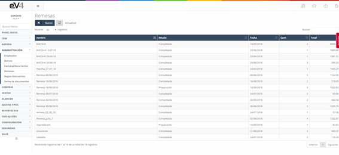
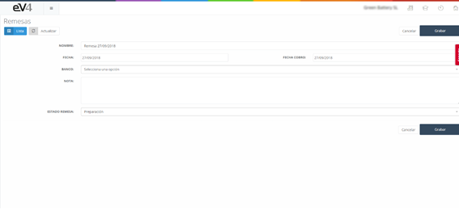
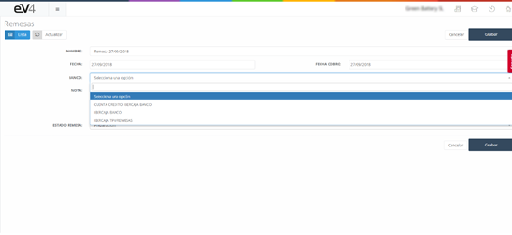
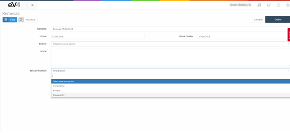
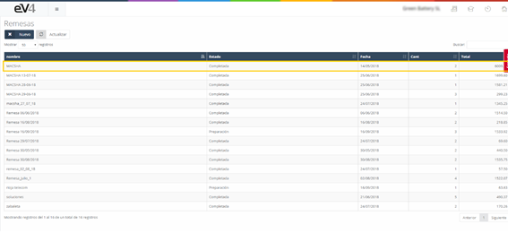
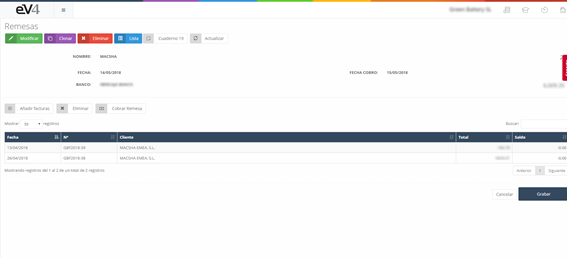
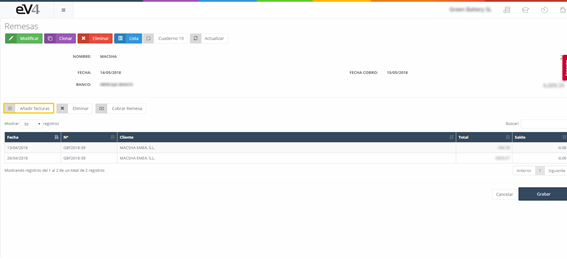
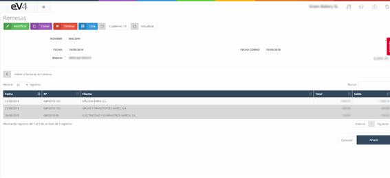
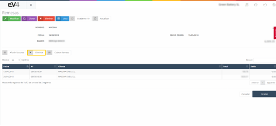
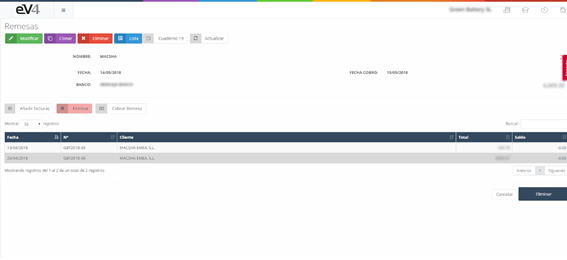

---

title: Remittances
description: A remittance is essentially a document used to settle a purchase or sale of goods.

---

#### Remittances

A remittance is essentially a document used to settle the purchase or sale of any type of goods. It is a financial document where we instruct our bank to manage the collection or payment of that transaction we have made. In other words, it is a file in which one or several sets of receipts are handed over to our bank, and the bank manages the collection of all the documents we are requesting.

Once we have the remittance document, we must send it to our bank to proceed with the collection or payment of the amounts.

##### For example:

Imagine we are a company and want to pay our suppliers—10 of them in order to settle debts. We create a remittance with all the required details (including amounts, supplier, date, etc.), and after sending it to the bank, it will handle the payments to all of them. This way, we don't need to make each transfer ourselves. It is the payment order. This allows us to settle the invoices we want to pay.

##### How do remittances work?

When we talk about income remittances, i.e., collections, we are giving an order to the bank to proceed with those collections. At that moment, the bank balance increases and the balance owed by customers is cleared.

When we talk about expense remittances, i.e., payments, we are giving an order to the bank to pay those amounts. At that point, the bank balance decreases, i.e., the treasury is reduced, and the outstanding balances with suppliers are settled.

After this, we will have managed our collections and payments.

When we enter the "REMITTANCES" section, we see the following screen:

Here, we have a list of the remittances created in the system.

To create a new remittance, click the **“NEW”** button.

We must fill out the following fields:

- **NAME**: The name by which we will identify the remittance.
- **DATE**: The date the remittance is created.
- **COLLECTION DATE**: The date the remittance will be collected.
- **BANK**: The bank account where the remittance amount will be charged or credited. By clicking on this field, a dropdown will appear allowing us to select one of the already configured accounts in the application.

- **NOTE**: Here, we can add a brief description for informational purposes.
- **REMITTANCE STATUS**: By clicking on this field, a dropdown will appear allowing us to select one of the following statuses: Completed, Sent, or Preparation.

Once all fields are filled in, click the **“SAVE”** button to store the remittance in the system.

Once we're in the general view of the "REMITTANCES" section, to consult a remittance, just click on it.

You will see the invoices or receipts that make up the remittance.

Now, let’s look closely at the function of the following buttons:

- **Add Invoices**: This button allows us to add invoices to the remittance.

By clicking this button, a new window will open with a list of invoices available to be added to the remittance. Please refer to the end of the section for the configuration of invoices to be shown.

To select an invoice, click on it, and it will be highlighted in gray. Repeat this process with all the invoices you want to add. To finalize, click the **“Add”** button, and the selected invoices will be included in the remittance.

If you click the **“Back to invoices in remittance”** button, you will return to the previous screen.

- **Delete**: This button allows us to remove invoices from the remittance.

By clicking this button, it will change color to red. Select the invoices you want to delete from the remittance, and they will be highlighted in gray. To remove them from the remittance, click the **“Delete”** button. The remittance will be modified, and the changes will be saved in the system.

