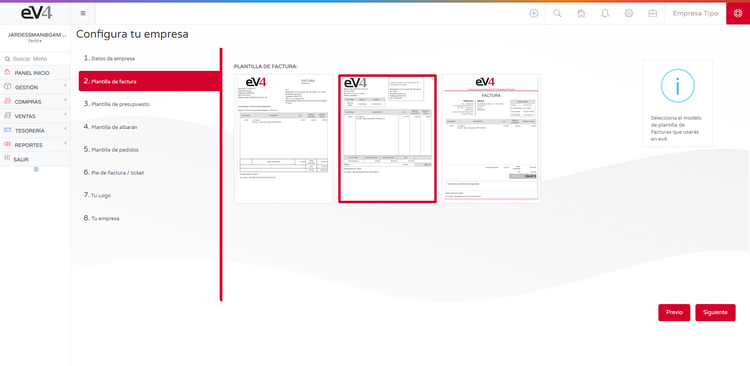

---

title: Setup Assistant Tips

---

# Initial Configuration

The initial configuration assistant allows us to set up the basic aspects of the system in eight easy steps.

## 1. Company Data

- **Business Name:** The official business name of the company.
- **Trade Name:** The company's trade name.
- **Tax ID (NIF):** The company's Tax Identification Number.
- **Country:** The country where the company is registered.
- **Province:** The province where the company is registered.
- **Tax Address:** The registered address of the company.
- **Postal Code:** The postal code of the location where the company is registered.
- **Phone:** The company's phone number.
- **Fax:** The company's fax number.
- **Equivalence Surcharge:** YES/NO. If enabled, the equivalence surcharge will be applied to all sales invoices.

## 2. Invoice Template

On this screen, we can select the template that the system will use for invoices. Simply click on the chosen template and then click the **Next** button.

## 3. Budget Template

On this screen, we can select the template that the system will use for budgets. Simply click on the chosen template and then click the **Next** button.

## 4. Delivery Note Template

On this screen, we can select the template that the system will use for delivery notes. Simply click on the chosen template and then click the **Next** button.

## 5. Order Template

On this screen, we can select the template that the system will use for orders. Simply click on the chosen template and then click the **Next** button.

## 6. Invoice/Ticket Footer

On this screen, we can customize the text that will appear in the footer of invoices, tickets, and invoice headings. Once done, simply click the **Next** button.

## 7. Your Logo

On this screen, you can add your company logo. The image should be **280 x 72 pixels** and in **PNG** format.

- Click the trash can icon to delete the existing image.
- Drag your company logo to this space.
- Then click the **Next** button.

## 8. Your Company

In this final step, we have a summary of all the settings made.

- Now you can check that all the data is correct.
  - If correct, click the **Finish** button.
  - If not, click the **Previous** button as many times as needed until you reach the screen where you want to correct the data.

