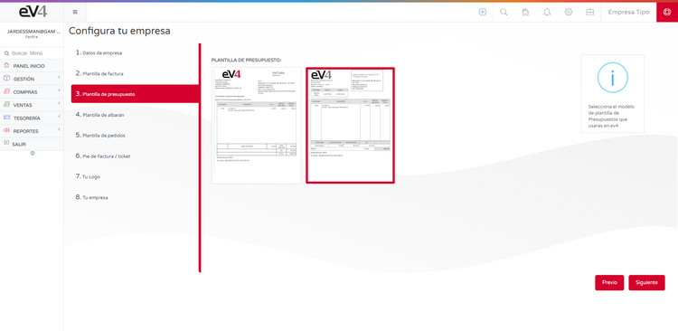

---

title: Assistant Configuration Tips  
description: Configuration for the assistant  

---

## INITIAL CONFIGURATION

The initial configuration assistant allows us to configure the basic aspects of the system in eight easy and quick steps.

### 1.- COMPANY DATA:

- **LEGAL NAME**: The legal name of the company.
- **TRADE NAME**: The trade name of the company.
- **VAT NUMBER**: The company’s VAT Identification Number.
- **COUNTRY**: The country where the company is registered.
- **PROVINCE**: The province where the company is registered.
- **TAX ADDRESS**: The address where the company is registered.
- **POSTAL CODE**: The postal code of the locality where the company is registered.
- **PHONE**: The company’s phone number.
- **FAX**: The company’s fax number.
- **EQUIVALENCE SURCHARGE**: YES/NO. If enabled, the corresponding equivalence surcharge will be applied to all sales invoices.

---

### 2.- INVOICE TEMPLATE:

In this screen, we can select the template that the system will use for invoices. Simply click on the chosen template and then click the **NEXT** button.

---

### 3.- QUOTE TEMPLATE:

In this screen, we can select the template that the system will use for quotes. Simply click on the chosen template and then click the **NEXT** button.

---

### 4.- DELIVERY NOTE TEMPLATE:

In this screen, we can select the template that the system will use for delivery notes. Simply click on the chosen template and then click the **NEXT** button.

---

### 5.- ORDER TEMPLATE:

In this screen, we can select the template that the system will use for orders. Simply click on the chosen template and then click the **NEXT** button.

---

### 6.- INVOICE/TICKET FOOTER:

In this screen, we can customize the text that will appear in the footer of invoices, tickets, and invoice headings. When finished, simply click the **NEXT** button.

---

### 7.- YOUR LOGO:

In this screen, you can add your **company logo**. The image size must be **280 x 72 pixels** and in **PNG** format.

To upload the logo:
- Click on the trash can icon to delete the existing image.
- Drag and drop your company logo into this space.
- Click the **NEXT** button.

---

### 8.- YOUR COMPANY:

In this final step, we have a **summary** of all the settings made.

Now we can check that all the data is correct. If it is, click the **FINISH** button. If not, click the **PREVIOUS** button as many times as needed to go back to the screen where the data needs to be corrected.

