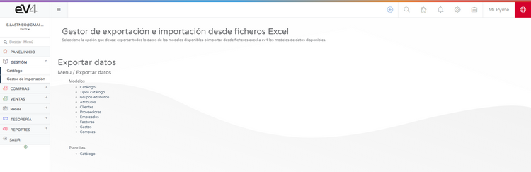

---

title: Create Product  
---  
# Inventory  

**To start selling, you first need to have inventory.**  
You can create products for your inventory manually from the section: **MANAGEMENT → CATALOG**.  

## Product Creation  

If we click on the **NEW** button, the product form will open for completion.  

You can also **import/export** the catalog using Excel files with our **IMPORT MANAGER**.  

We recommend using the provided template for better control of the data to be imported.  
Once you've created or imported your products, you can start creating and managing **orders, delivery notes, and sales**.  

## Catalog Export  

You can export your catalog in its entirety or only partially.  

Once you've created or imported your products, you can start creating and managing **orders, delivery notes, and sales**.  

  
