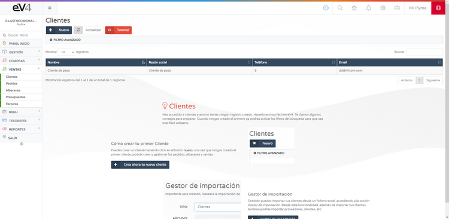
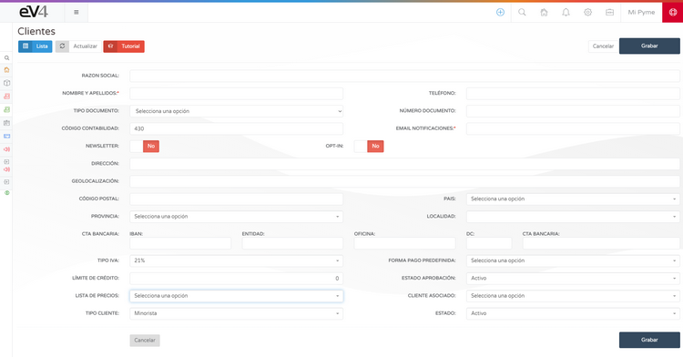
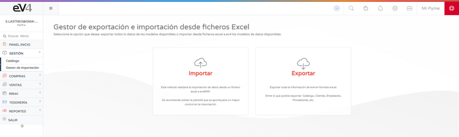
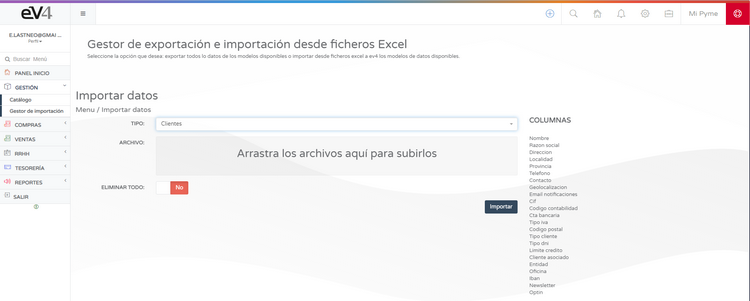

---

title: Create Customer  
---  
# Customers  

To start selling, you need to have customers.  
**eV4ERP** comes with a default **TEMPORARY CUSTOMER** already configured.  

## Add Customers  

You can manually add customers from the section: **SALES → CUSTOMERS**.  

If you click on the **NEW** button, the customer form will open for completion.  

You can also **import/export** the customer list using Excel files with our **IMPORT MANAGER**.  

We recommend using the provided template for better control of the data to be imported.  
Once you've created or imported your customer list, you can start creating and managing **orders, delivery notes, and sales**.  

## Exporting Customers  

You can export your customer list using the **EXPORT MANAGER**.  

Once you've created or imported your customers, you can start creating and managing **orders, delivery notes, and sales**.  
