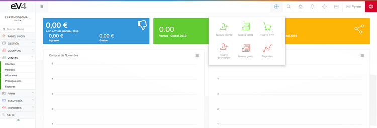

---

title: Create Invoice  
---  
# Create the First Invoice  

We’ve made the first sale. Now, let’s create the first invoice.  

## Create an Invoice  

The fastest way to create an invoice is by clicking the **ADD** button (blue button on the top right) and then clicking the **NEW INVOICE** button.  

You can also create an invoice by accessing the path: **SALES → INVOICES**.  

Click the **NEW** button, and the form where you can create the invoice will appear.  

## Complete the Invoice  

1. **Select the series** to which the invoice belongs.  
2. **Add the customer** (the customer must be registered in the database).  
3. **Select the date** (by default, today’s date).  
4. **Set the payment terms**, due date, and payment method.  

## Add Products to the Invoice  

- **By barcode:**  
  - If you have a scanner, you can scan the barcode.  
  - Click on the **BARCODE REFERENCE** field.  
  - When the field turns blue, manually type the reference or use the scanner.  

- **By item name:**  
  - Click on the **SELECT AN ITEM** field.  
  - A search bar will appear where you can type the item name.  
  - All matching items will appear below.  

## Manage Invoice Lines  

- To add a new line to the invoice, click the **+ NEW LINE** button in the center of the screen or the blue button with a **+** on the left.  
- To delete a line, click the red button with an **X** inside.  

## Save the Invoice  

To save the invoice in the system, click the **SAVE** button.  

> ⚠️ **Note:** Invoices do not subtract stock.
