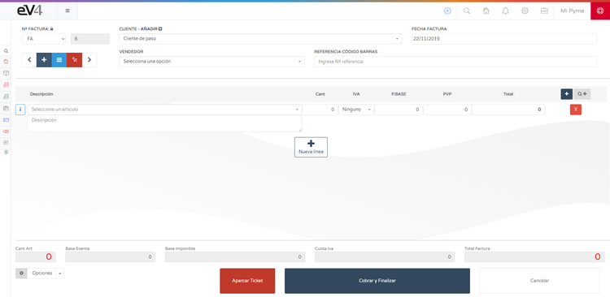
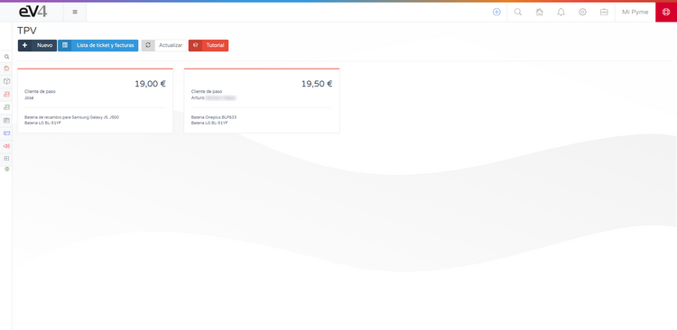

---

title: Create Ticket  
---  

# POS - Create the First Ticket  

We’ve made the first sale. Now, let’s create the first ticket.  

## Create a Ticket  

The fastest way to create a ticket is by clicking the **ADD** button (blue button on the top right) and then clicking the **NEW POS** button.  

Click the **NEW POS** button, and the screen to create the ticket will appear.  

## Complete the Ticket  

We need to select:  
- **SERIES**  
- **CUSTOMER**  
- **DATE**  
- **SELLER**  

## Add Products to the Ticket  

- **By barcode:**  
  - If you have a scanner, you can scan the barcode.  
  - Click on the **BARCODE REFERENCE** field.  
  - When the field turns blue, manually type the reference or use the scanner.  

- **By item name:**  
  - Click on the **SELECT AN ITEM** field.  
  - A search bar will appear where you can type the item name.  
  - All matching items will appear below.  

## Manage Ticket Lines  

- To add a new line, click the **+ NEW LINE** button in the center of the screen or the blue button with a **+** on the left.  
- To delete a line, click the red button with an **X** inside.  

### Advanced Search  

The gray button **Q+** opens an advanced search that allows you to filter items by:  
- **NAME**  
- **REFERENCE**  
- **EAN-13**  
- **BRAND**  
- **SUPPLIER**  

## Park and Retrieve Tickets  

- The red button **PARK TICKET** allows you to **save a ticket** without completing the payment.  
- You can later retrieve it exactly as it was "parked" to finish the payment.  
- The **CANCEL** button discards the ticket and returns us to the list of tickets.  

To retrieve a parked ticket, simply click on it, and it will load on the screen.  
> ⚠️ **Note:** A parked ticket loads in the same state it was saved, except for the **series**, which must be assigned manually.  

The last two tickets in the list **do not have a series assigned** because they are parked tickets.  

## Finalize the Ticket  

1. Click **CHARGE AND FINISH**.  
2. A window will open to select the **payment method** and **enter the amount given**.  
3. You can click on the **0.00** amounts with the mouse and delete them to calculate the change.  
4. To complete the operation, click the **FINISH** button.  

## Ticket List  

- The light blue button with **three horizontal lines** in the top right takes us to the **list of tickets stored** in the system.  

- The red button **PARKED TICKETS** shows the parked tickets.  

To retrieve a "parked" ticket, just click on it, and it will load on the screen.  

The ticket will load in the same state it was before being "parked," except for one aspect, the **series**, which must be manually assigned. When a ticket is "parked," it is saved without a series assigned.  

The last two tickets in the list do not have a series assigned because they are "parked" tickets.  

✅ **Tickets deduct stock.**
