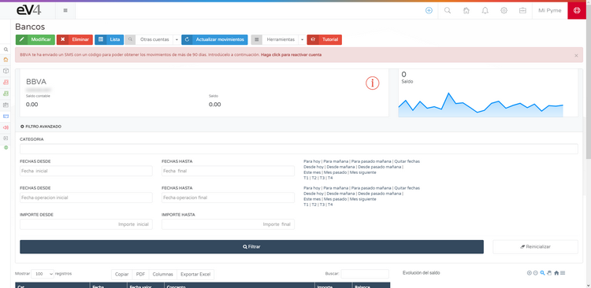

---

title: Bank Connection Test  
---

# CONNECT WITH YOUR BANK  

eV4 allows you to connect with your bank to check your bank transactions. eV4 only has access to your bank data in **read-only mode**, meaning it can only view the data. It will **never** be able to perform financial operations (payments, transfers, etc.).  

This function can be accessed from the menu **TREASURY → BANKS**.  

## First Connection  

The first time you access, you will see the following screen.  

Click on the **CONNECT WITH YOUR BANK** button, and you will see the next screen where you need to select your bank.  

eV4 works with over **100 banking institutions across Europe and America**. You can filter the banks by country by clicking on it, or search for them directly by name. Once you find it, click on it.  

eV4 adapts to the working methods of each bank and will ask you for the required information from the bank.  

Once you’ve entered the required information, click the **CONNECT** button.  

## Request Bank Transactions  

The first time eV4 connects to your bank, it will request transactions from the **last year**.  

> ⚠️ To request transactions from **periods over 90 days**, according to European regulations, your bank must provide you with a **control code**, which you will need to enter next.  

Click the **VALIDATE** button and wait for the process to complete. Afterward, the accounts you have with this bank will appear on the screen.  

## Actions on Bank Accounts  

If any of the accounts have a **red symbol** with an **"i" inside a circle**, it means that the user needs to take action. If you click on an account, you will enter it.  

Follow the instructions, in this case, click on the **CLICK HERE TO REACTIVATE ACCOUNT** button.  

And wait for it to finish.  

**Continue.**
