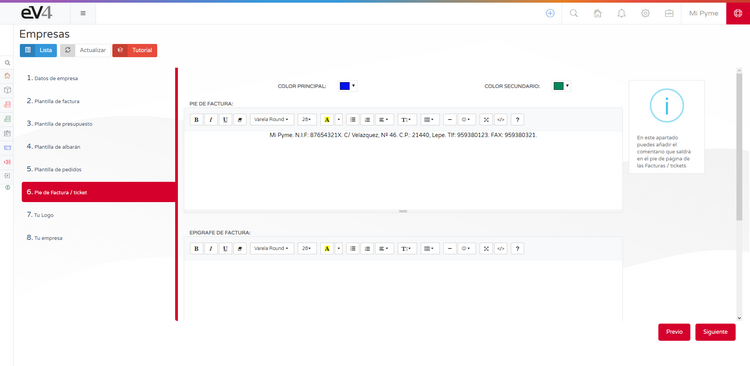

---

title: Setup Assistant  
---

# INITIAL SETUP  

The initial setup assistant allows you to configure the basic aspects of the system in **eight steps**, quickly and easily.  

## 1.- COMPANY DATA:  

- **LEGAL NAME:** The legal name of the company.  
- **TRADING NAME:** The business name of the company.  
- **TAX ID NUMBER (NIF):** The Tax Identification Number of the company.  
- **COUNTRY:** The country where the company is registered.  
- **PROVINCE:** The province where the company is registered.  
- **TAX ADDRESS:** The address where the company is registered.  
- **POSTAL CODE:** The postal code of the location where the company is registered.  
- **PHONE:** The company's phone number.  
- **FAX:** The company's fax number.  
- **EQUIVALENCE SURCHARGE:** **YES/NO**. If this option is enabled, the equivalence surcharge will be applied to all sales invoices.  

## 2.- INVOICE TEMPLATE:  

On this screen, we can select the template that the system will use for invoices. Simply click on the chosen template, then click the **NEXT** button.  

## 3.- QUOTATION TEMPLATE:  

On this screen, we can select the template that the system will use for quotations. Simply click on the chosen template, then click the **NEXT** button.  

## 4.- DELIVERY NOTE TEMPLATE:  

On this screen, we can select the template that the system will use for delivery notes. Simply click on the chosen template, then click the **NEXT** button.  

## 5.- ORDER TEMPLATE:  

On this screen, we can select the template that the system will use for orders. Simply click on the chosen template, then click the **NEXT** button.  

## 6.- INVOICE/TICKET FOOTER:  

On this screen, we can customize the text that will appear in the **footer of invoices, ticket footer, and the invoice heading**. When finished, simply click the **NEXT** button.  

## 7.- YOUR LOGO:  

On this screen, you can add your **company logo**. The image should be **280 x 72 pixels** and in **PNG** format.  

To change the logo:  

1. Click the **trash icon** to delete the existing image.  
2. Drag your **company logo** to this location.  
3. Click the **NEXT** button.  

## 8.- YOUR COMPANY:  

In this final step, you will see a **summary of all the settings** made.  

Now you can check that all the data is correct.  

- If the data is correct, click the **FINISH** button.  
- If something needs to be corrected, click the **PREVIOUS** button as many times as necessary to go back to the screen where the data you want to modify is located.  
